## On the Opportunities and Challenges of Foundation Models for Geospatial Artificial Intelligence

GENGCHEN MAI, SEAI Lab, Department of Geography, University of Georgia, USA

School of Computer Science and Engineering, Nanyang Technological University, Singapore

Geospatial Data Science Lab, Department of Geography, University of Wisconsin-Madison, USA

School of Computer Science and Engineering, Nanyang Technological University, Singapore

WEIMING HUANG, JIN SUN, School of Computing, University of Georgia, USA SUHANG SONG, College of Public Health, University of Georgia, USA DEEPAK MISHRA, Department of Geography, University of Georgia, USA NINGHAO LIU, School of Computing, University of Georgia, USA SONG GAO, TIANMING LIU, School of Computing, University of Georgia, USA GAO CONG, YINGJIE HU, GeoAI Lab, Department of Geography, University at Buffalo, USA CHRIS CUNDY, Department of Computer Science, Stanford University, USA ZIYUAN LI, School of Business, University of Connecticut, USA RUI ZHU, School of Geographical Sciences, University of Bristol, United Kingdom NI LAO, Google, USA

Large pre-trained models, also known as foundation models (FMs), are trained in a task-agnostic manner on large-scale data and can be adapted to a wide range of downstream tasks by fine-tuning, few-shot, or even zero-shot learning. Despite their successes in language and vision tasks, we have yet seen an attempt to develop foundation models for geospatial artificial intelligence (GeoAI). In this work, we explore the promises and challenges of developing multimodal foundation models for GeoAI. We first investigate the potential of many existing FMs by testing their performances on seven tasks across multiple geospatial subdomains including Geospatial Semantics, Health Geography, Urban Geography, and Remote Sensing. Our results indicate that on several geospatial tasks that only involve text modality such as toponym recognition, location description recognition, and US state-level/county-level dementia time series forecasting, these task-agnostic LLMs can outperform task-specific fully-supervised models in a zero-shot or few-shot learning setting. However, on other geospatial tasks, especially tasks that involve multiple data modalities (e.g., POI-based urban function classification, street view image-based urban noise intensity classification, and remote sensing image scene classification), existing foundation models still underperform task-specific models. Based on these observations, we propose that one of the major challenges of developing a FM for GeoAI is to address the multimodality nature of geospatial tasks. After discussing the distinct challenges of each geospatial data modality, we suggest the possibility of a multimodal foundation model which can reason over various types of geospatial data through geospatial alignments. We conclude this paper by discussing the unique risks and challenges to develop such a model for GeoAI.

Permission to make digital or hard copies of all or part of this work for personal or classroom use is granted without fee provided that copies are not made or distributed for profit or commercial advantage and that copies bear this notice and the full citation on the first page. Copyrights for components of this work owned by others than ACM must be honored. Abstracting with credit is permitted. To copy otherwise, or republish, to post on servers or to redistribute to lists, requires prior specific permission and/or a fee. Request permissions from permissions@acm.org.

© 2018 Association for Computing Machinery.

Manuscript submitted to ACM

CCS Concepts: · Computing methodologies → Natural language processing ; Unsupervised learning ; Computer vision ; Knowledge representation and reasoning ; Neural networks ; · Applied computing → Earth and atmospheric sciences .

Additional Key Words and Phrases: Foundation Models, Geospatial Artificial Intelligence, Multimodal Learning

## ACMReference Format:

Gengchen Mai, Weiming Huang, Jin Sun, Suhang Song, Deepak Mishra, Ninghao Liu, Song Gao, Tianming Liu, Gao Cong, Yingjie Hu, Chris Cundy, Ziyuan Li, Rui Zhu, and Ni Lao. 2018. On the Opportunities and Challenges of Foundation Models for Geospatial Artificial Intelligence. In . ACM, New York, NY, USA, 37 pages. https://doi.org/XXXXXXX.XXXXXXX

## 1 INTRODUCTION

Recent trends in machine learning (ML) and artificial intelligence (AI) speak to the unbridled powers of data and computing. Extremely large models trained on Internet-scale datasets have achieved state-of-the-art (SOTA) performance on a diverse range of learning tasks. In particular, their unprecedented success has spurred a paradigm shift in the way that modernday ML models are trained. Rather than learning task-specific models from scratch [33, 76, 135], such pre-trained models (so-called 'foundation models (FMs)' [13]) are adapted via fine-tuning or few-shot/zero-shot learning strategies and subsequently deployed on a wide range of domains [15, 112]. Such FMs allow for the transfer and sharing of knowledge across domains, and mitigate the need for task-specific training data. Examples of foundation models are 1) large language models ( 𝐿𝐿𝑀 ) such as PaLM [140], LLAMA [132], GPT-3 [15], InstrucGPT [106], and ChatGPT [104]; 2) large vision foundation models such as Imagen [126], Stable Diffusion [124], DALL · E2 [117], and SAM [72]; 3) large multimodal foundation models such as CLIP [112], OpenCLIP [54], BLIP [82], OpenFlamingo [11], KOSMOS-1 [49], and GPT-4 [105]; and 4) large reinforcement learning foundation models such as Gato [121].

Despite their successes, there exists very little work exploring the development of an analogous foundational model for geospatial artificial intelligence (GeoAI), which lies at the intersection of geospatial scientific discoveries and AI technologies [31, 55, 93]. The key technical challenge here is the inherently multimodal nature of GeoAI. The core data modalities in GeoAI include text, images (e.g., remote sensing or street view images), trajectory data, knowledge graphs, and geospatial vector data (e.g., map layers from OpenStreetMap), all of which contain important geospatial information (e.g., geometric and semantic information). Each modality exhibits special structures that require its own unique representation - effectively combining all these representations with appropriate inductive biases in a single model requires careful design. The multimodal nature of GeoAI hinders a straightforward application of existing pre-trained FMs across all GeoAI tasks.

In this paper, we lay the groundwork for developing FMs for GeoAI. We begin by providing a brief overview of existing foundation models in Section 2. Then in Section 3, we investigate the potential of existing FMs for GeoAI by systematically comparing the performances of several popular foundation models with many state-of-the-art fully supervised task-specific machine learning or deep learning models on various tasks from different geospatial domains: 1) Geospatial Semantics : toponym recognition and location description recognition task; 2) Health Geography : US state-level and county-level dementia death count time series forecasting task; 3) Urban Geography : Point-of-interest (POI) based urban function classification task and street-level image-based noise intensity classification task; 4) Remote Sensing : remote sensing (RS) image scene classification task. The advantages and problems of FM on different geospatial tasks are discussed accordingly. Next, in Section 4, we detail the challenges involved in developing FMs for GeoAI. Creating one single FM for all GeoAI data modalities can be a daunting task. To address this, we start this discussion by examining each data modality used in GeoAI tasks. Then, we propose our vision for a novel multimodal FM framework for GeoAI that tackles the aforementioned challenges. Finally, we highlight some potential risks and challenges that should be considered when developing such general-purpose models for GeoAI in Section 5 and conclude this paper in Section 6.

Our contributions can be summarized as follows:

- To the best of our knowledge, this is the first work that systematically examines the effectiveness and problems of various existing cutting-edge foundation models on different geospatial tasks across multiple geoscience domains 1 . We establish various FM baselines on seven geospatial tasks for future Geospatial Artificial General Intelligence (GeoAGI) research.
- We discuss the challenges of developing a multimodal foundation model for GeoAI and provide a promising framework to achieve this goal.
- We discuss the risks and challenges that need to be taken into account during the development and evaluation process of the multimodal geo-foundation model.

## 2 RELATED WORK

## 2.1 Language Foundation Model

In less than a decade, computational natural language capabilities have been completely revolutionized [15, 69, 109, 116] by large-scale language modeling (LLMs). Language modeling [62] is the simple task of predicting the next token in a sequence given previous tokens 2 , and it corresponds to a self-supervised objective in the sense that no human labeling is needed besides a natural text corpus. When applied to vast corpora such as documents of diverse topics from the internet, LLMs gain significant language understanding and generation capabilities. Various transfer-learning and scaling studies [40, 43, 66] have demonstrated an almost linear relationship between downstream task quality and the log sizes of self-supervised model and data. Combined with the ever-increasing availability of data and computing, language modeling has become a reliable approach for developing increasingly powerful models.

Representative examples of these LLMs are the OpenAI GPTs [15, 105, 114, 115]. By pretraining from vast amounts of Web data, the GPT models gain knowledge of almost all domains on the Web, which can be leveraged to solve problems of diverse verticals [15]. The interfaces to access such knowledge have become increasingly simple and intuitive - ranging from supervised fine-tuning with labeled data [114, 115], to few-shot learning [15] and instructions [106], to conversation [104] and multimodality [105]. In this study, we provide a comprehensive analysis of the potentials and limitations of GPT and other LLMs when applied to different geospatial domains.

## 2.2 Vision Foundation Model

Computer vision has long been dominated by task-specific models: for example, YOLO [120] for object detection, Detectron [143] for instance segmentation, and SRGAN [78] for image super-resolution. The newest example is Meta AI's Segment Anything Model (SAM) [72], which is designed for interactive object segmentation. ResNet [36] trained on ImageNet [24] has been used as the backbone feature extractor for many such tasks. It can be seen as the early form of a vision foundation model.

Inspired by the great success of language foundation models, the computer vision community builds large-scale vision foundation models that can be adapted to any vision task. The most direct adoption of the idea from language models in computer vision is the image generation models. Since the dominance of Generative Adversarial Networks

1 This work is a significant extension of our previous 4-page vision paper published in ACM SIGPATIAL 2022 [92] by adding five additional tasks in Health Geography, Urban Geography, and Remote Sensing domains.

2 There is also a different variant which predicts masked spans in text [69, 116].

[32, 67], the quality of image generation models has seen a major breakthrough via the development of diffusion-based models [41]. Imagen [126] builds on large transformer-based language models to understand text prompts and generates high-fidelity images using diffusion models. DALL-E · 2 [117] trains a diffusion decoder to invert an image encoder from visual-language models such as CLIP. After pre-training, it is able to generate images of various styles and characteristics. Stable Diffusion [124] uses a Variational Autoencoder (VAE) [71] to convert raw images from pixel space to latent space where the diffusion processes are more manageable and stable. It has shown great flexibility in conditioning over text, pose, edge maps, semantic maps, and scene depths [156]. GigaGAN [64], on the other hand, is a recent attempt of scaling up GAN models.

Vision-Transformer (ViT) [25] is a widely used architecture in vision foundation models. Large-scale ViT has been developed to scale up the model [153]. The Swin Transformer [88] model is designed to handle the unique challenges of adapting regular transformer models with various spatial resolutions in images. Other large-scale non-transformer models are also developed to reach the same level of performance: ConvNext [89] is the 'modernized' version of convolutional neural networks that has a large number of parameters and shows a similar level of performance as Swin Transformers. MLP-mixer [131] is an architecture that utilizes only multi-layer perceptrons on image data. It shows competitive scores on image classification datasets.

## 2.3 Multimodal Foundation Model

Developing artificial intelligence models that are capable of performing multimodal reasoning and understanding on complex data is a promising idea. Humans naturally perform multimodal reasoning in daily life [108] for example, when a person is thinking about the concept of 'dog', they will not only think about the English word and its meaning but also a visual image and a sound associated with it. In the context of geospatial tasks, multimodal data are ubiquitous. In general, data from different modalities provide different 'views' that complement each other and provide more information to facilitate a holistic understanding of the data.

Recently, much progress has been made in building large-scale multimodal foundation models for joint reasoning from various domains, in particular, vision and language. CLIP [54, 112] is one of the first widely-adopted vision-language joint training frameworks. It uses self-supervised contrastive learning to learn a joint embedding of visual and text features. BLIP [82] improves over CLIP by training on synthetically-generated captions from internet-collected images. It is designed to handle both visual-language understanding and generation tasks. BEiT-3 [138] is a general-purpose multimodal foundation model that achieves state-of-the-art performance on both vision and vision-language tasks. It combines features from multi-modality expert networks. Florence [151] is a vision-language foundation model that learns universal visual-language representations for objects, scenes, images, videos, as well as captions. Similarly, KOSMOS-1 [49] learns from web-scale multimodal data including text and image pairs. It can transfer knowledge from one modality to another. Flamingo [6] is a family of visual language models that can be adapted to novel tasks using only a few annotated examples, i.e., few-shot learning. It encodes images or videos as inputs along with textual tokens to jointly reason about vision tasks. The newest version of the GPT model, the GPT-4 [105], also claims to perform multimodal analysis including text, audio, images, and videos.

## 3 EXPLORATION OF THE EFFECTIVENESS OF EXISTING FMS ON VARIOUS GEOSPATIAL DOMAINS

The first question we would like to ask is how the existing cutting-edge foundation models perform when compared with the state-of-the-art fully supervised task-specific models on various geospatial tasks. Geography is a very broad discipline that includes various subdomains such as Geospatial Semantics [46, 57, 60, 75, 97], Health Geography

[19, 68, 125], Urban Geography, [17, 52, 65, 154, 165], Remote Sensing [16, 28, 79, 100, 123], and so on. To address the aforementioned question, in the following, we conduct experiments using various FMs on different tasks in the four geospatial subdomains mentioned earlier. The advantages and weaknesses of existing FMs will be discussed in detail.

## 3.1 Geospatial Semantics

Listing 1. Typonym recognition with LLMs, e.g., GPT-3. Yellow block: the text snippet to be annotated. Orange box: GPT-3 outputs. 8 few-shot samples are used in this prompt. We only show 1 here while skipping others with "..." to save space.

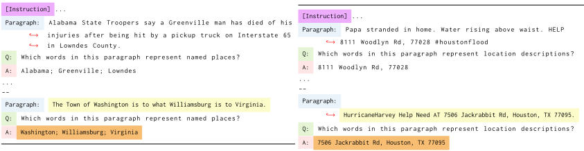

Listing 2. Location description recognition with LLMs, e.g., GPT3. Yellow block: the input text snippet. Orange box: GPT-3 outputs. 11 few-shot samples are used while 1 is shown.

As a starting point for our discussion, we first demonstrate empirically the promise of leveraging LLMs for solving geospatial semantics tasks. We hope that our results not only demonstrate the effectiveness of such general-purpose, few-shot learners in the geospatial semantics domain, but also challenges the current paradigm of training task-specific models as a common practice in GeoAI research.

We compare the performance of 4 pre-trained GPT-2 [115] models of varying sizes provided by Huggingface as well as the most recent GPT-3 [15] (i.e., text-davinci-002), InstructGPT [106] (i.e., text-davinci-003), and ChatGPT [104] (i.e., gpt-3.5-turbo) models developed by OpenAI with multiple supervised, task-specific baselines on two representative geospatial semantics tasks: (1) toponym recognition [33, 134], and (2) location description recognition [45].

3.1.1 Toponym Recognition. Toponym recognition is a subtask of named entity recognition (NER), with the goal of identifying named places from a given text snippet. We use the Hu2014 [47] and Ju2016 [61] benchmark datasets as two representative datasets for this task. We adapt 7 pre-trained GPT models to perform toponym recognition tasks by using appropriate prompts containing few-shot training examples. In the prompt, we provide several training samples as few-shot learning samples in the form of natural language instructions. One example of such a prompt is illustrated in Listing 1, while the full prompts can be found in List 7 in Appendix A.1. It is worth noting that ChatGPT , as a foundation model, is optimized for chatbot purposes and expects conversational inputs rather than a single big prompt. In order to conduct a controlled experiment, we first use the same prompt shown in Listing 1 to instruct all 7 pre-trained GPT models to perform toponym recognition. We also convert the few-shot examples into a list of conversations and use them as the inputs for ChatGPT which is denoted as ChatGPT (Con.) while the ChatGPT using the original prompt is indicated as ChatGPT (Raw.).

Table 1 compares all 8 GPT models with 15 baselines on two datasets - Hu2014 [47] and Ju2016 [61]. The same test sets have been used to evaluate the performances of all models. Please refer to Hu et al. [47] and Ju et al. [61] for detailed descriptions of both datasets. Those 15 baselines are classified into three groups as shown in Table 1: (A) general NER (named entity recognition) models; (B) no neural network (NN) based geoparsers; (C) fully supervised task-specific NN-based geoparsers. All models in Group C are trained in a supervised manner on the same separated training datasets. With the exception of the smallest GPT2 model, all other LLMs consistently outperform the fully-supervised baselines on the Hu2014 dataset, even though they only require a small set of natural language instructions without any additional training. GPT-3 in particular demonstrated an 8.7% performance improvement over the previous SOTA (TopoCluster [23]). Interestingly, new GPT models such as InstructGPT and ChatGPT do not show higher performances on the Hu2014 dataset. While InstructGPT shows a smaller performance drop which is acceptable, two ChatGPT models show more significant performance decreases. One reasonable hypothesis is that ChatGPT is further optimized based on InstructGPT for chatbot applications that may not be 'flexible' enough to be adapted to new tasks such as toponym recognition.

Based on previous studies [134, 135], the Ju2016 dataset is a very difficult task. On this dataset, we found that GPT2-XL outperforms the previous SOTA (NeuroTPR [135]) by over 2.5% while using only 8 few-shot examples in the prompt . In contrast, a task-specific model, such as NeuroTPR, requires supervised training on 599 labeled tweets and labeled sentences generated from 3000 Wikipedia articles. GPT-3 and InstructGPT does not show performance improvement on the Ju2016 dataset over GPT2-XL. Similar to the finding on the Hu2014 dataset, ChatGPT shows a significant performance decrease on the Ju2016 dataset. In accordance with existing empirical findings [15, 115], we also found that the performance of these LLMs tended to scale with the number of learnable parameters.

3.1.2 Location Description Recognition. The location description recognition task is slightly more challenging - given a text snippet (e.g., tweets), the goal is to recognize more fine-grained location descriptions such as home addresses, highways, roads, and administration regions. HaveyTweet2017 [45] is used as one representative benchmark dataset for this task. The same set of pre-trained GPT models and 15 baselines are used for this task. Listing 2 shows one example prompt used in this task and the full prompt can be seen in Listing 8 in Appendix A.1.

Table 1 summarizes the evaluation results of different models on the HaveyTweet2017 dataset. The same test set of HaveyTweet2017 is used to evaluate all GPT models as well as 15 baseline models. On the HaveyTweet2017 dataset, GPT-3 achieves the best recall score across all methods. However, all LLMs have rather low precision (and therefore low F1-scores). This is because LLMs implicitly convert the location description recognition problem into a natural language generation problem (see List 2), meaning that they are not guaranteed to generate tokens that appear in the input text. Based on the experimental results in Table 1, we can clearly see that by using just a small number of few-shot samples, LLMs can outperform the fully-supervised, task-specific models on well-defined geospatial semantics tasks . This showcases the potential of LLMs to dramatically reduce the need for customized architectures or large labeled datasets for geospatial tasks. However, how to develop appropriate prompts to instruct LLMs for a given geospatial semantics task require further investigation.

## 3.2 Health Geography

The next set of experiments focuses on an important health geography problem - dementia death counts time series forecasting for a given geographic region such as cities, counties, states, etc. With a growing share of older adults in the population, it is estimated that more than 7 million US adults aged 65 or older were living with dementia in 2020, and the number could increase to over 9 million by 2030 and nearly 12 million by 2040 [167]. Alzheimer's disease, the most common type of dementia, has been reported to be one of the top leading causes of death in the US, with 1 in 3 seniors dying with Alzheimer's or another dementia by 2019 [9]. Notably, there are substantial and longstanding geographical disparities in mortality due to dementia [4, 8]. Subnational planning and prioritizing dementia prevention strategies require local mortality data. Prediction of dementia deaths at the sub-national level will assist in informing future tailored health policies to eliminate geographical disparities in dementia and to achieve national health goals.

Table 1. Evaluation results of various GPT models and baselines on two geospatial semantics tasks: (1) toponym recognition (Hu2014 [47] and Ju2016 [61]) and (2) location description recognition (HaveyTweet2017 [45]) . We classify all models into four groups: (A) General NER; (B) No Neural Network (NN) based geoparsers; (C) Fully-supervised NN-based geoparsers; (D) Few-show learning with LLMs. "(#Param)" indicates the number of learnable parameters of LLMs. "(nar. loc.)" and "(bor. loc.)" indicate narrow location models and broad location models defined in [135]. The results of all baselines (i.e., models in Group A, B, and C) are obtained from [134] and [135] except "0.675 † ", which is obtained by rerunning the official code of [135]. The evaluation results of different GPT models (Group D) are done by using pre-trained GPT2/GPT-3/InstructGPT/ChatGPT models with appropriate prompts. The results of four GPT2 models are obtained by using Huggingface pre-trained GPT2models with various model sizes. The last four models are obtained by using various OpenAI's GPT models - text-davinci-002, text-davinci-003, and gpt-3.5-turbo - which are denoted as GPT-3, InstructGPT, and ChatGPT respectively. Since ChatGPT expects conversational inputs rather than a single big prompt, we experiment with two versions of ChatGPT. ChatGPT (Raw.) indicates we use the same prompt as other GPT models while ChatGPT (Con.) indicates we convert the few-shot examples in the prompt into a list of conversations. ∗ Due to OpenAI API limitations, we evaluate GPT-3, InstructGPT, and ChatGPT on randomly sampled 544 Ju2016 examples (10% of the dataset).

| Model                                      | #Param   | Toponym Recognition - Hu2014 - Accuracy ↓   | Toponym Recognition - Ju2016 - Accuracy ↓   | Location Description Recognition - HaveyTweet2017 - Precision   | Location Description Recognition - HaveyTweet2017 - ↓ Recall ↓   | Location Description Recognition - HaveyTweet2017 - F-Score ↓   |
|--------------------------------------------|----------|---------------------------------------------|---------------------------------------------|-----------------------------------------------------------------|------------------------------------------------------------------|-----------------------------------------------------------------|
| Stanford NER (nar. loc.) [30]              | -        | 0.787                                       | 0.010                                       | 0.828                                                           | 0.399                                                            | 0.539                                                           |
| Stanford NER (bro. loc.) [30]              | -        | -                                           | 0.012                                       | 0.729                                                           | 0.44                                                             | 0.548                                                           |
| Retrained Stanford NER [30]                | -        | -                                           | 0.078                                       | 0.604                                                           | 0.410                                                            | 0.489                                                           |
| Caseless Stanford NER (nar. loc.) [30]     | -        | -                                           | 0.460                                       | 0.803                                                           | 0.320                                                            | 0.458                                                           |
| (A) Caseless Stanford NER (bro. loc.) [30] | -        | -                                           | 0.514                                       | 0.721                                                           | 0.336                                                            | 0.460                                                           |
| spaCy NER (nar. loc.) [44]                 | -        | 0.681                                       | 0.000                                       | 0.575                                                           | 0.024                                                            | 0.046                                                           |
| spaCy NER (bro. loc.) [44]                 | -        | -                                           | 0.006                                       | 0.461                                                           | 0.304                                                            | 0.366                                                           |
| DBpedia Spotlight[99]                      | -        | 0.688                                       | 0.447                                       | -                                                               | -                                                                | -                                                               |
| Edinburgh [7]                              | -        | 0.656                                       | 0.000                                       | -                                                               | -                                                                | -                                                               |
| (B) CLAVIN [134]                           | -        | 0.650                                       | 0.000                                       | -                                                               | -                                                                | -                                                               |
| TopoCluster [23]                           | -        | 0.794                                       | 0.158                                       | -                                                               | -                                                                | -                                                               |
| CamCoder [33]                              | -        | 0.637                                       | 0.004                                       | -                                                               | -                                                                | -                                                               |
| Basic BiLSTM+CRF [77]                      | -        | -                                           | 0.595                                       | 0.703                                                           | 0.600                                                            | 0.649                                                           |
| (C) DMNLP (top. rec.) [139]                | -        | -                                           | 0.723                                       | 0.729                                                           | 0.680                                                            | 0.703                                                           |
| NeuroTPR [135]                             | -        | 0.675 †                                     | 0.821                                       | 0.787                                                           | 0.678                                                            | 0.728                                                           |
| GPT2 [115]                                 | 117M     | 0.556                                       | 0.650                                       | 0.540                                                           | 0.413                                                            | 0.468                                                           |
| GPT2-Medium [115]                          | 345M     | 0.806                                       | 0.802                                       | 0.529                                                           | 0.503                                                            | 0.515                                                           |
| GPT2-Large [115]                           | 774M     | 0.813                                       | 0.779                                       | 0.598                                                           | 0.458                                                            | 0.518                                                           |
| GPT2-XL [115]                              | 1558M    | 0.869                                       | 0.846                                       | 0.492                                                           | 0.470                                                            | 0.481                                                           |
| (D) GPT-3 [15]                             | 175B     | 0.881                                       | 0.811 ∗                                     | 0.603                                                           | 0.724                                                            | 0.658                                                           |
| InstructGPT [106]                          | 175B     | 0.863                                       | 0.817 ∗                                     | 0.567                                                           | 0.688                                                            | 0.622                                                           |
| ChatGPT (Raw.) [104]                       | 176B     | 0.800                                       | 0.696 ∗                                     | 0.516                                                           | 0.654                                                            | 0.577                                                           |
| ChatGPT (Con.) [104]                       | 176B     | 0.806                                       | 0.656 ∗                                     | 0.548                                                           | 0.665                                                            | 0.601                                                           |

In this work, we conduct time series forecasting on the number of deaths due to dementia in two geographic region levels - state level and county level. The dementia data are obtained from the US Centers for Disease Control and Prevention Wide-ranging Online Data for Epidemiologic Research (CDC WONDER 3 ), which is a publicly available dataset. Dementia deaths are classified according to the International Classification of Diseases, Tenth Revision (ICD-10), including unspecified dementia (F03), Alzheimer's disease (G30), vascular dementia (F01), and other degenerative diseases of nervous system, not elsewhere classified (G31) [73].

[3 https://wonder.cdc.gov/ucd-icd10.html](https://wonder.cdc.gov/ucd-icd10.html)

3.2.1 US State-Level Dementia Time Series Forecasting. We collect annual time series of dementia death counts for all 51 US states between 1999 and 2020. The time series from 1999 to 2019 are used as training data, and the numbers in 2020 are used as ground truth labels. The same set of pre-trained GPT models used in Section 3.1 are utilized in this task. Different from the geospatial semantics experiments, we utilize all GPT models in a zero-shot setting since we think the historical time series data is enough for a LLM to perform the forecasting. Listing 3 shows one example prompt we use in this experiment by using California as an example.

With only 51 time series, each consisting of 22 data points, many sequential deep learning models such as RNNs (recurrent neural networks) and Transformers [133] are at risk of overfitting on this dataset. So we pick the state-ofthe-art machine learning-based time series forecasting model - ARIMA (Autoregressive integrated moving average) as the fully supervised task-specific baseline model. We train individual ARIMA models on each state's time series using data from 1999 to 2019, and perform forecasting on data in 2020. Hyperparameter tuning is performed on all ARIMA hyperparameters to obtain the best results. Additionally, we use persistence model [103, 107] as a reference. A persistence model assumes that the future value of a time series remains the same between the current time and the forecast time. In our case, we use the dementia death count of each state in 2019 as the prediction for the value in 2020.

Table 2 presents a comparison of model performances among different GPT models and two baselines. Interestingly, all GPT2 models perform poorly on all evaluation metrics. Their performances are even worse than the simple persistence model. This suggests that GPT2 may struggle with zero-shot time series forecasting. On the other hand, GPT-3, InstructGPT, and two ChatGPT models demonstrate reasonable performances. Of particular interest is that InstructGPT outperforms the best ARIMA model on all evaluation metrics even though InstructGPT is not finetuned on this specific task. We propose two hypothetical reasons for the strong performance of InstructGPT in the time series forecasting task: 1) After training on a large-scale text corpus, InstructGPT may have developed the intelligence necessary to perform zero-shot time series forecasting, which is fundamentally an autoregressive problem. 2) It is possible that InstructGPT and GPT-3 may be exposed to US state-level dementia time series data during their training on the large-scale text corpus.

While we cannot determine which of these reasons is the primary factor behind InstructGPT's success, these results are very encouraging. Similar to the results in Table 1, two ChatGPT models underperform InstructGPT. More experiment analysis can be seen in the county-level experiments.

Table 2. Evaluation results of various GPT models and baselines on the US state-level dementia time series forecasting task. We classify all models into four groups: (A) Simple persistent model; (B) Fully supervised machine learning models such as ARIMA; (C) Zero-shot learning with LLMs. "(#Param)" indicates the number of learnable parameters of LLMs. The denotations of different GPT models are the same as Table 1. Four evaluation metrics are used: MSE (mean square error), MAE (mean absolute error), MAPE (mean absolute percentage error), and R 2 . ↑ and ↓ indicate the direction of better models for each metric. For all GPT models, we encode time series information between 1999 and 2019 in the prompt and let it generate data in 2020.

|                   | Model                  | #Param   |      MSE ↓ |   MAE ↓ |   MAPE ↓ |   R 2 ↑ |
|-------------------|------------------------|----------|------------|---------|----------|---------|
| (A) Simple        | Persistence [103, 107] | -        |    985,179 |     630 |    0.096 |   0.971 |
| (B) Supervised ML | ARIMA [58]             | -        |    562,768 |     462 |    0.067 |   0.984 |
| (C) Zero shot LM  | GPT2 [115]             | 117M     | 44,635,055 |   4,898 |    0.955 |  -0.271 |
| (C) Zero shot LM  | GPT2-Medium [115]      | 345M     | 42,315,630 |   4,616 |    0.745 |  -0.209 |
| (C) Zero shot LM  | GPT2-Large [115]       | 774M     | 39,039,733 |   4,250 |    0.779 |  -0.132 |
| (C) Zero shot LM  | GPT2-XL [115]          | 1558M    | 35,355,840 |   3,912 |    0.709 |  -0.026 |
| (C) Zero shot LM  | GPT-3 [15]             | 175B     |    587,263 |     474 |    0.070 |   0.983 |
| (C) Zero shot LM  | InstructGPT [106]      | 175B     |    387,413 |     365 |    0.055 |   0.989 |
| (C) Zero shot LM  | ChatGPT (Raw.) [104]   | 176B     |  1,143,675 |     623 |    0.121 |   0.967 |
| (C) Zero shot LM  | ChatGPT (Con.) [104]   | 176B     |  4,224,811 |   1,131 |    0.240 |   0.890 |

```
[Instruction] This is a set of time series forecasting problems. The ` Paragraph ` is a time series of the numbers of deaths from ↩ → alzheimer 's disease for one of US state from 1999 to 2019. The goal is to predict the number of deaths from alzheimer 's disease ↩ → at this state in 2020. Please give a single number as the ↩ → prediction. -- -- Paragraph: At California , From 1999 to 2019, the numbers of deaths ↩ → from alzheimer 's disease are 6761 in 1999, 6760 in 2000, 7474 ↩ → in 2001, 8366 in 2002, 9760 in 2003, 9806 in 2004, 11497 in 2005, ↩ → 13520 in 2006, 13730 in 2007, 16395 in 2008, 16290 in 2009, 18000 ↩ → in 2010, 19924 in 2011,20814 in 2012, 22061 in 2013, 22412 in 2014, ↩ → 23606 in 2015, 24060 in 2016, 25017 in 2017, 25218 in 2018, and ↩ → 25810 in 2019. Q: Please forecast the number in 2020 at California? A: 26670 [Instruction] This is a set of time series forecasting problems. The ` Paragraph ` is a time series of the numbers of deaths from ↩ → alzheimer 's disease for one of US counties from 1999 to 2019. The goal is to predict the number of deaths from alzheimer 's disease at ↩ → this county in 2020. Please give a single number as the ↩ → prediction. -- -- Paragraph: At Santa Barbara County , CA, from 1999 to 2019, the numbers ↩ → of deaths from alzheimer 's disease are ↩ → 126 in 1999, 114 in 2000, 124 in 2001, 127 in 2002, 156 in 2003, ↩ → 154 in 2004, 175 in2005, 172 in 2006, 171 in 2007, 248 in 2008, 204 ↩ → in 2009, 241 in 2010, 260 in 2011, 297 in 2012, 283 in 2013, 308 in ↩ → 2014, 358 in 2015, 365 in 2016, 334 in 2017, 363 in 2018, ↩ → and 328 in 2019. Q: Please forecast the number in 2020 at Santa Barbara County , CA? A: 345
```

Listing 3. US state-level Alzimier time series forecasting with LLMs by zero-shot learning. Yellow block: the historical time series data of one US state. Orange box: the outputs of InstructGPT. Here, we use California as an example and the correct answer is 29400. Listing 4. US county-level Alzimier time series forecasting with LLMs by zero-shot learning. Yellow block: the historical time series data of one US county. Orange box: the outputs of InstructGPT. Here, we use Santa Barbara County, CA as an example and the correct answer is 373.

3.2.2 US County-Level Dementia Time Series Forecasting. In terms of county-level data, we utilized the dementia death count time series of all US counties with available data, resulting in a total of 2447 US counties selected for analysis. We only considered counties with dementia annual death records spanning more than four years between 1999 and 2020. Similarly to Section 3.2.1, we utilize all available data up to the given year for training ARIMA models and generating GPT prompts, and then make predictions for the following year. We employ the same set of GPT models and baselines as in the state-level experiment to conduct the county-level experiment. Listing 4 shows one example prompt we use in this experiment by using Santa Barbara County, CA as an example.

Table 3. Evaluation results of various GPT models and baselines on the US county-level dementia time series forecasting task. We use same model set and evaluation metrics as Table 2.

|                    | Model                  | #Param   |   MSE ↓ |   MAE ↓ |   MAPE ↓ |   R 2 ↑ |
|--------------------|------------------------|----------|---------|---------|----------|---------|
| (A) Simple         | Persistence [103, 107] | -        |   1,648 |    16.9 |    0.189 |   0.979 |
| (B) Supervised ML  | ARIMA [58]             | -        |   1,133 |    15.1 |    0.193 |   0.986 |
| (C) Zero shot LLMs | GPT2 [115]             | 117M     |  77,529 |    92.0 |    0.587 |  -0.018 |
| (C) Zero shot LLMs | GPT2-Medium [115]      | 345M     | 226,259 |   108.1 |    0.611 |  -2.824 |
| (C) Zero shot LLMs | GPT2-Large [115]       | 774M     | 211,881 |    94.3 |    0.581 |  -1.706 |
| (C) Zero shot LLMs | GPT2-XL [115]          | 1558M    | 162,778 |    99.8 |    0.627 |  -1.082 |
| (C) Zero shot LLMs | GPT-3 [15]             | 175B     |   1,105 |    14.5 |    0.180 |   0.986 |
| (C) Zero shot LLMs | InstructGPT [106]      | 175B     |     831 |    13.3 |    0.179 |   0.989 |
| (C) Zero shot LLMs | ChatGPT (Raw.) [104]   | 176B     |   4,115 |    23.2 |    0.217 |   0.955 |
| (C) Zero shot LLMs | ChatGPT (Con.) [104]   | 176B     |   3,402 |    20.7 |    0.231 |   0.944 |

Table 3 compares the results of different models. Similar findings can be seen from these results. All GPT2 models perform poorly. However, both GPT-3 and InstructGPT outperform the best ARIMA models on all evaluation metrics, while two ChatGPT models underperform them. Among the two ChatGPT models, ChatGPT (Con.) are slightly better than ChatGPT (Raw.) on all metrics except MAPE.

To further understand the geographical distributions of prediction errors for each model, we visualize the prediction errors of each model on each US county in Figure 1. In the figure, the red color represents overestimations of the corresponding model while the blue colors indicate underestimations. Moreover, the intensity of the color indicates the magnitude of the prediction error, with darker colors representing larger errors. We can see that Persistence, ARIMA, GPT-3, and InstructGPT generally demonstrate better forecasting performance. However, the prediction percentage errors are not uniformly distributed across different US counties. As persistence uses the previous year's data as the prediction, Figure 1a indicates that the growth rates of dementia death counts are uneven for different counties. The southwest of the U.S. shows a recent increase in dementia death counts which leads the persistence model to underestimate the true data. The current maps of prediction errors show that the distributions of errors of GPT-3 and InstructGPT are not uniform across the US counties, and it is unclear whether the uneven distribution is due to the geographic bias encoded in the models or the spatial heterogeneity of the growth rate of dementia death counts. Further analysis is needed to determine the cause of these uneven distributions.

One obvious observation from Figure 1 is that all GPT2 models turn to significantly underestimate the dementia data. To understand the cause of this behavior and the superiority of GPT-3 and InstructGPT, we showcase the generated answers of different GPT models for four US counties in Table 4. From Table 4, it is evident that GPT2 in many times will repeat the information provided in our prompt rather than generating novel predictions. For example, in the Clarke County, GA and Santa Barbara County, CA cases, all three GPT2 models (i.e., GPT2-Medium, GPT2-Large, and GPT2-XL) predict the same numbers as the data in 1999. This suggests that these models rely heavily on the prompt information instead of learning from the time series data, which could explain their inferior performance compared to other models such as GPT-3 and InstructGPT. In the other two counties' cases, the predictions of the GPT2 models vary significantly. In most cases, both InstructGPT and ChatGPT (Raw.) generate a single number as the prediction, indicating that they understand the task they are expected to perform. The only exception is the Santa Barbara County case, where ChatGPT (Raw.) generates a short sentence containing a reasonable prediction. However, based on our evaluation, the predictions of ChatGPT (Raw.) are not as good as those of GPT-3. Interestingly, when using ChatGPT in a conversational context, i.e., ChatGPT (Con.), ChatGPT usually returns a very long sentence. In the New York County case, ChatGPT (Con.) is unable to give a prediction, suggesting that ChatGPT is useful in a chatbot context but may not be the best choice for other tasks such as time series forecasting.

Fig. 1. Prediction error maps of each baseline and GPT model on US county-level dementia death count time series forecasting task. The color on each US count indicates the percentage error 𝑃𝐸 = ( 𝑃𝑟𝑒𝑑𝑖𝑐𝑡𝑖𝑜𝑛 - 𝐿𝑎𝑏𝑒𝑙 )/ 𝐿𝑎𝑏𝑒𝑙 of each model prediction on this county. Those counties in gray color indicate their dementia data during 1999 and 2020 are not available.

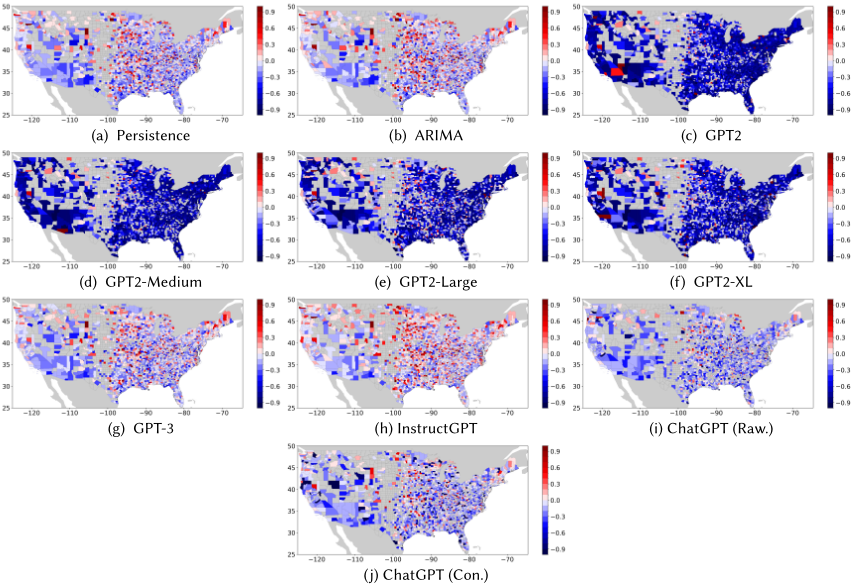

## 3.3 Urban Geography

The third set of FM experiments focuses on research problems in the Urban Geography domain. Two representative tasks are selected: 1) an urban function task that aims at predicting the urban functions of a geographic region based on the Points of Interest (POIs) within it [51, 52, 102, 147, 152]; 2) an urban perception task that focuses on predicting the urban neighborhood characteristics (e.g., housing price, safety, noise intensity level) based on street view imagery (SVI) [65, 154, 162]. Since these tasks involve different data modalities such as point data, text, and images, we use different foundation models to handle each task.

3.3.1 POI-Based Urban Function Classification. The first experiment focuses on predicting the urban functions of a geographic region based on the Points of Interest (POIs) within it. This is a common Urban Geography task aimed at understanding the structure of the urban space [51, 52, 102, 147, 152].

Table 4. Generated answers by various GPTs models for four US counties in US county-level dementia time series forecasting problem. 'County' and 'Label' columns indicate the US county and its true dementia death count in 2020. 'Generated Answer' indicates the generated answer for different GPT models in which the numbers in bold are the predictions we extract from these answers.

| County                   |   Label Model | Label Model                | Generated Answer                                                                                                                                                                                                                                                                                                                                                                                                                               |
|--------------------------|---------------|----------------------------|------------------------------------------------------------------------------------------------------------------------------------------------------------------------------------------------------------------------------------------------------------------------------------------------------------------------------------------------------------------------------------------------------------------------------------------------|
| Clarke County, GA        |            79 | GPT2                       | The number of deaths from alzheimer's disease is 21 in 1999, 37 in 2000, 32 in 2001, 25 in 2002, 29 in 2003, 44 in 2004, 38 in 2005, 41 in 2006, 52 in 2007, 46 in 2008                                                                                                                                                                                                                                                                        |
| Clarke County, GA        |            79 | GPT2-Medium                | The number of deaths from alzheimer's disease in Clarke County, GA is 21 in 2020.                                                                                                                                                                                                                                                                                                                                                              |
| Clarke County, GA        |            79 | GPT2-Large                 | The number of deaths from alzheimer's disease in 2020 is: 21 in 2020, 37 in 2021, 32 in 2022, 25 in 2023, 29 in 2024, 44 in 2025, 38 in 2026, 42 in 2027, 42                                                                                                                                                                                                                                                                                   |
| Clarke County, GA        |            79 | GPT2-XL                    | The number in 2020 is: 21 .                                                                                                                                                                                                                                                                                                                                                                                                                    |
| Clarke County, GA        |            79 | GPT-3                      | The number of deaths from Alzheimer's disease in 2020 at Clarke County, GA is forecast to be 81 .                                                                                                                                                                                                                                                                                                                                              |
| Clarke County, GA        |            79 | InstructGPT                | 83                                                                                                                                                                                                                                                                                                                                                                                                                                             |
| Clarke County, GA        |            79 | ChatGPT (Raw.)             | 78                                                                                                                                                                                                                                                                                                                                                                                                                                             |
| Clarke County, GA        |            79 | ChatGPT (Con.)             | Based on the available historical data, the forecast for the number of deaths from Alzheimer's disease in Clarke County,GA in 2020 would be 81 .                                                                                                                                                                                                                                                                                               |
| New York County, NY      |           835 | GPT2                       | The number of deaths from alzheimer's disease is 91 in 1999, 121 in 2000, 118 in 2001, 155 in 2002, 214 in 2003, 243 in 2004, 219 in 2005, 294 in 2006, 296 in 2007, 364 in 2008                                                                                                                                                                                                                                                               |
| New York County, NY      |           835 | GPT2-Medium                | The number of deaths from alzheimer's disease in New York County, NY is 9,965 .                                                                                                                                                                                                                                                                                                                                                                |
| New York County, NY      |           835 | GPT2-Large                 | The number of deaths from alzheimer's disease in New York County, NY is 91 in 2020.                                                                                                                                                                                                                                                                                                                                                            |
| New York County, NY      |           835 | GPT2-XL                    | The number in 2020 is: 901 .                                                                                                                                                                                                                                                                                                                                                                                                                   |
| New York County, NY      |           835 | GPT-3                      | The number of deaths from alzheimer's disease in 2020 at New York County, NY is 932 .                                                                                                                                                                                                                                                                                                                                                          |
| New York County, NY      |           835 | InstructGPT                | 902                                                                                                                                                                                                                                                                                                                                                                                                                                            |
| New York County, NY      |           835 | ChatGPT (Raw.)             | 855                                                                                                                                                                                                                                                                                                                                                                                                                                            |
| New York County, NY      |           835 | ChatGPT (Con.)             | Based on the historical data provided, a common approach for time series forecasting is to use methods such as exponential smoothing or ARIMA. However, without further information on the specific pattern or trend in the data, it is difficult to provide an accurate prediction for the number of deaths from alzheimer's disease in New York County, NY for 2020. Therefore, I am unable to provide a single number as the prediction.    |
| San Francisco County, CA |           592 | GPT2                       | The number of deaths from alzheimer's disease is 1,000 . The number of deaths from alzheimer's disease is 2,000. The number of deaths from alzheimer's disease is 3,000. The number of deaths from                                                                                                                                                                                                                                             |
| San Francisco County, CA |           592 | GPT2-Medium                | The number of deaths from alzheimer's disease is 201 in 2020.                                                                                                                                                                                                                                                                                                                                                                                  |
| San Francisco County, CA |           592 | GPT2-Large                 | The number of deaths from alzheimer's disease in 2020 is 574 .                                                                                                                                                                                                                                                                                                                                                                                 |
| San Francisco County, CA |           592 | GPT2-XL                    | The number in 2020 is 201 .                                                                                                                                                                                                                                                                                                                                                                                                                    |
| San Francisco County, CA |           592 | GPT-3                      | 571                                                                                                                                                                                                                                                                                                                                                                                                                                            |
| San Francisco County, CA |           592 | InstructGPT                | 590                                                                                                                                                                                                                                                                                                                                                                                                                                            |
| San Francisco County, CA |           592 | ChatGPT (Raw.)             | 579                                                                                                                                                                                                                                                                                                                                                                                                                                            |
| San Francisco County, CA |           592 | ChatGPT (Con.)             | Based on the historical data provided, a possible forecasting method is to use a time series model, such as ARIMA or exponential smoothing. Without fitting such a model, a simple approach would be to assume a trend of similar magnitude to recent years and a similar level of annual variation. Using this approach, a possible prediction for the number of deaths from alzheimer's disease in San Francisco County, CA in 2020 is 583 . |
| Santa Barbara County, CA |               | GPT2                       | The number of deaths from alzheimer's disease is 126 in 1999, 114 in 2000, 124 in 2001, 127 in 2002, 156 in 2003, 154 in 2004, 175 in 2005, 172 in 2006, 171 in 2007, 248 in 2008                                                                                                                                                                                                                                                              |
| Santa Barbara County, CA |               | GPT2-Medium                | The number of deaths from alzheimer's disease in Santa Barbara County, CA is 126 in 2020.                                                                                                                                                                                                                                                                                                                                                      |
| Santa Barbara County, CA |               | GPT2-Large                 | The number of deaths from alzheimer's disease in Santa Barbara County, CA is: 126 in 2020.                                                                                                                                                                                                                                                                                                                                                     |
| Santa Barbara County, CA |               | 373 GPT2-XL                | The number in 2020 is: 126 .                                                                                                                                                                                                                                                                                                                                                                                                                   |
| Santa Barbara County, CA |               | GPT-3                      | The number of deaths from alzheimer's disease in 2020 at Santa Barbara County, CA is expected to be about 350 .                                                                                                                                                                                                                                                                                                                                |
| Santa Barbara County, CA |               | InstructGPT ChatGPT (Raw.) | 345 predict the number of deaths from alzheimer's disease in 2020 at Santa Barbara County, CA to be 356 .                                                                                                                                                                                                                                                                                                                                      |
| Santa Barbara County, CA |               | I ChatGPT (Con.)           | Based on the historical data provided, the prediction for the number of deaths from Alzheimer's disease in 2020 at Santa                                                                                                                                                                                                                                                                                                                       |
| Santa Barbara County, CA |               |                            | Barbara County, CA is 327 .                                                                                                                                                                                                                                                                                                                                                                                                                    |

To quantitively evaluate the performance of LLMs on this urban function prediction task, we utilize a Points of Interest (POI) dataset from Shenzhen, China which consists of 303,428 POIs and 5,461 urban neighborhoods with POIs [26, 27, 159, 160]. We denote this dataset as 𝑈𝑟𝑏𝑎𝑛𝑃𝑂𝐼 5 𝐾 . Figure 2 shows the geographic distributions of the POIs and regions. The ground truth data is from the Urbanscape Essential Dataset of Peking University . The dataset provides detailed spatial distributions of ten urban function types in the study area: forest, water, unutilized, transportation, green space, industrial, educational &amp; governmental, commercial, residential, and agricultural. To simplify the task, we merge the uncommon urban function types forest, water, unutilized, green space, and agricultural into the function type outdoors and natural . This results in six urban function types: (1) residential; (2) commercial; (3) industrial; (4) education, health care, civic, governmental and cultural, (5) transportation facilities, and (6) outdoors and natural. In total, 5,344 of the regions have ground truth data. We randomly split this dataset into training, validation and test sets with the ratio 60%:20%:20%. The test dataset is used to evaluate the performance of different models, while the validation set is only used for supervised baselines.

Fig. 2. The spatial distributions of POI data in the 𝑈𝑟𝑏𝑎𝑛𝑃𝑂𝐼 5 𝐾 dataset.

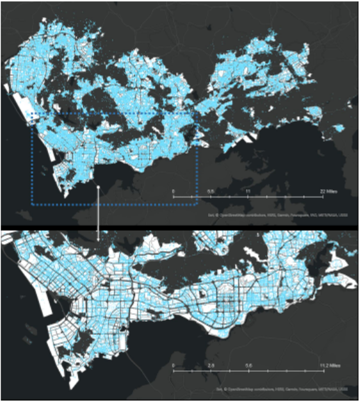

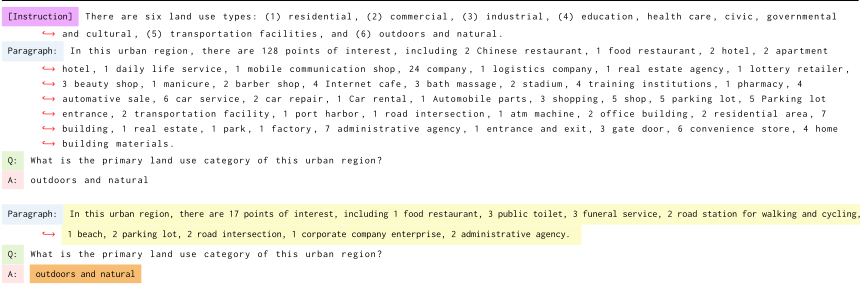

Listing 5. POI-based urban function classification with LLMs, e.g., ChatGPT (Raw.). Yellow block: the POI statistic of a new urban neighborhood to be classified. Orange box: ChatGPT (Raw.) outputs.

In order to enable a LLM to handle such a task, we convert the set of POIs inside an urban region into a textual paragraph that describes the frequencies of POIs with different place types. Then, we ask the LLM to predict the urban function of the region based on the paragraph (here we ask for the most dominating function, in spite of the common presence of mix-used urban regions). Listing 5 shows one example prompt for this task, which includes a paragraph-question-answer tuple as a demonstration. LLMs adapted by this kind of prompt is conducting prediction under a one-shot setting. For the zero-shot setting, we simply remove this paragraph-question-answer tuple from the prompt. We use GPT2 with various sizes, GPT-3, and two ChatGPT models to perform this task under both zero-shot and one-shot settings. For comparison, we use two supervised learning neural network baselines:

Table 5. Evaluation results of various GPT models and supervised baseline on the 𝑈𝑟𝑏𝑎𝑛𝑃𝑂𝐼 5 𝐾 dataset for the POI-based urban function classification task. We divide the models into three groups: (A) supervised learning-based neural network models; (B) Zero-shot learning with LLMs. (C) One-shot learning with LLMs. We use accuracy, weighted precision, and weighted recall as evaluation metrics. We do not include weighted F1 scores since it is the same as the accuracy score. The best model of each group is highlighted.

|                    | Model                |   Accuracy |   Precision |   Recall |
|--------------------|----------------------|------------|-------------|----------|
| (A) Supervised NN  | Place2Vec [145, 152] |      0.540 |       0.512 |    0.516 |
|                    | HGI [52]             |      0.584 |       0.568 |    0.563 |
| (B) Zero-shot LLMs | GPT2 [115]           |      0.318 |       0.105 |    0.158 |
| (B) Zero-shot LLMs | GPT2-Medium [115]    |      0.025 |       0.102 |    0.040 |
| (B) Zero-shot LLMs | GPT2-Large [115]     |      0.005 |       0.001 |    0.002 |
| (B) Zero-shot LLMs | GPT2-XL [115]        |      0.001 |       0.108 |    0.002 |
| (B) Zero-shot LLMs | GPT-3 [15]           |      0.144 |       0.448 |    0.141 |
| (B) Zero-shot LLMs | ChatGPT (Raw.) [104] |      0.075 |       0.376 |    0.106 |
| (B) Zero-shot LLMs | ChatGPT (Con.) [104] |      0.051 |       0.232 |    0.046 |
| (C) One-shot       | GPT2 [115]           |      0.149 |       0.079 |    0.085 |
| (C) One-shot       | GPT2-Medium [115]    |      0.317 |       0.104 |    0.156 |
|                    | GPT2-Large [115]     |      0.057 |       0.083 |    0.021 |
| LLMs               | GPT2-XL [115]        |      0.324 |       0.105 |    0.159 |
| LLMs               | GPT-3 [15]           |      0.176 |       0.486 |    0.190 |
| LLMs               | ChatGPT (Raw.) [104] |      0.195 |       0.524 |    0.245 |
| LLMs               | ChatGPT (Con.) [104] |      0.093 |       0.451 |    0.085 |

- Place2Vec : We first learn POI category embeddings following the Place2Vec method [145]. Then, given an urban region with 𝐾 POIs, we convert each POI into its corresponding Place2Vec embedding and perform mean pooling to obtain region embeddings as Zhai et al. [152] did. The resulting neighborhood embeddings are fed into a one-hidden-layer multilayer perceptron (MLP) to supervise learning its urban function over the 𝑈𝑟𝑏𝑎𝑛𝑃𝑂𝐼 5 𝐾 training dataset.
- HGI : HGI is an unsupervised method for learning region representations based on POIs. It takes into account the categorical semantics of POIs, as well as POI-level and region-level adjacency, and the multi-faceted influence from POIs to regions [52]. The HGI region embeddings are fed into an MLP with the same setup to predict the primary urban function.

Table 5 shows the evaluation results of all models on the test dataset of 𝑈𝑟𝑏𝑎𝑛𝑃𝑂𝐼 5 𝐾 . Additionally, we visualize the confusion matrics of two baseline models, 7 zero-shot GPT models, and 7 one-shot GPT models in Figure 3, 4, and 5. We can see that:

- In the zero-shot setting, GPT-3 achieves the best precision scores among all GPT models but still underperforms HGI models.
- Interestingly, in the zero-shot setting, the smallest GPT2 achieves the best accuracy and recall scores which is counter-intuitive. The reason can be seen in Figure 4a. GPT2 predicts almost all neighborhood as 'Residential' which account for 30+% of the ground truth data.

Fig. 3. Confusion matrices of Place2Vec and HGI (Group A in Table 5) on the 𝑈𝑟𝑏𝑎𝑛𝑃𝑂𝐼 5 𝐾 dataset.

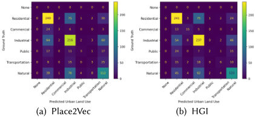

- In the one-shot setting, ChatGPT (Raw.) becomes the best model among all GPT models in terms of both precision and recall. It achieves 52.4% precision which is only 4.4% less than HGI . Its confusion matrix in Figure 5f also demonstrates that ChatGPT (Raw.) has reasonably good performance on all urban function classes.
- In the one-shot setting, GPT2-XL has the highest accuracy. However, Figure 5d shows that GPT2-XL is highly biased towards the 'Residential' class.

These experimental results highlight the challenges of using LLMs for urban function classification. Two main reasons contribute to their inadequate performance:

- POIs are initially used for search in online map services, and by nature, they contain rich information about commercial venues like restaurants and hotels. On the contrary, the venues that are not closely related to our daily life, e.g., factories, are often missing. In this regard, Shenzhen is a heavily industrial-oriented city, and the ground truth data indicates that there are many more industrial regions than commercial ones. However, LLMs tend to predict that a large number of regions are commercial, in view of the commercial-related POIs fed into it.
- In addition, LLMs are unable to access the spatial distributions of POIs, which highly influence POI-based urban function prediction since different spatial distributions of POIs yield different spatial interaction patterns and thus different urban functions. While both supervised baselines Place2Vec and HGI are learned from POI distributions during their place type embedding unsupervised training stage, it is not possible to inform LLMs of the spatial distributions of POIs. Converting a POI set into an image will also not work. This is because many POIs will cluster in the downtown area, and a large pixel size will make a large number of POIs inside one single pixel. On the other hand, a finer pixel size will make the image of an urban space too large and cannot be handled by other deep image encoders. Moreover, an urban space image with a finer pixel size will have very sparse information which is hard for image encoders to learn. In other words, we need to use specialized neural architectures to directly handle point data (also polyline data and polygon data). This calls for the necessity of incorporating encoding architectures of various geospatial vector data such as location encoding [91, 95], polyline encoding [118, 149], and polygon encoding techniques[98] into the GeoAI foundation model development . We will discuss this in detail in Section 4.6.

3.3.2 Street View Image-Based Urban Noise Intensity Classification. Street view images (SVI) are widely used in many Urban Geography studies to understand different characteristics of an urban neighborhood such as safety [154], beauty, affluence [80], depressing [154], housing prices [65], noise intensity levels [162], accessibility [35], etc. It becomes an important data source that complements remote sensing images.

Fig. 4. Confusion matrices of all GPT models (Group B in Table 5) on the 𝑈𝑟𝑏𝑎𝑛𝑃𝑂𝐼 5 𝐾 dataset under zero-shot setting.

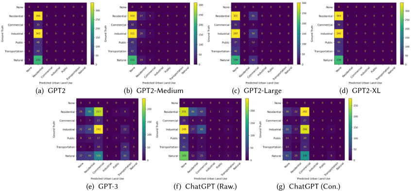

Fig. 5. Confusion matrices of all GPT models (Group C in Table 5) on the 𝑈𝑟𝑏𝑎𝑛𝑃𝑂𝐼 5 𝐾 dataset under the one-shot setting.

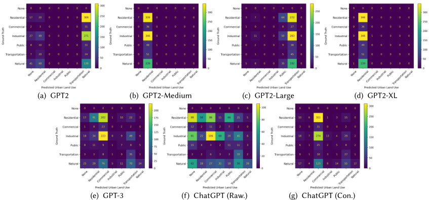

In this work, we use a recently developed street view image noise intensity dataset developed by Zhao et al. [162] as a representative urban perception task. This dataset consists of 579 street-view images collected from Singapore. The noise intensity score (between 0 and 1) were collected based on a human survey. Please refer to their Github 4 for a detailed description of this dataset. Since the sound intensity score is not a commonly agreed metric but an indicator defined by Zhao et al. [162], it would be challenging for visual foundation models trained on general web data such as OpenCLIP [54] and BLIP [82] to directly predict such a score. Therefore, we discretize the original noise intensity score of each street view image into four classes: very quiet (0 - 0.25), quiet (0.25 - 0.50), noisy (0.50 - 0.75), and very noisy (0.75 - 1.00). We denote this dataset as 𝑆𝑖𝑛𝑔𝑎𝑝𝑜𝑟𝑒𝑆𝑉𝐼 579. Figure 6 illustrates some street view image examples from each noise intensity class. We randomly split 𝑆𝑖𝑛𝑔𝑎𝑝𝑜𝑟𝑒𝑆𝑉𝐼 579 into 50% training and 50% testing sets, where the testing dataset is used to evaluate different CNN and foundation models.

[4 https://github.com/ualsg/Visual-soundscapes](https://github.com/ualsg/Visual-soundscapes)

Since all GPT models (except GPT-4) used in previous experiments are pure language models that cannot handle data modalities such as images. So for the street view image-based noise intensity prediction task, we select the latest high-performance open visual-language foundation models (VLFM) including OpenCLIP [54], BLIP [82], and OpenFlamingo-9B [11]. Although, there exist more powerful visual-language foundation models such as DeepMind's Flamingo-9B [6], KOSMOS-1 [49], and GPT-4 [105], they are not openly accessible, nor do they provide API access yet 5 . We describe the setting of each VLFM as follows:

- OpenCLIP-L : We use an OpenCLIP [54] ViT L/14 model pre-trained with the LAION-2B English subset of LAION-5B 6 as a small-sized OpenCLIP model. We download the pre-trained model from Huggingface 7 .
- OpenCLIP-B : We use the OpenCLIP [54] ViT-bigG/14 model trained with the LAION-2B English subset of LAION-5B as a larger-sized OpenCLIP model. The pre-trained model is from Huggingface 8 .
- BLIP : We use the pre-trained BLIP-2 model [81] provided by Huggingface 9 which consists of a CLIP-like image encoder, a Querying Transformer (Q-Former), and a large language model (Flan T5-xl).
- OpenFlamingo-9B : We use the pre-trained OpenFlamingo-9B model [11] provided by Huggingface 10 which consists of an image encoder (CLIP ViT-L/14 [54]) and a large language model (LLaMA-7B [132]).

All VLFMs are evaluated on the testing set of 𝑆𝑖𝑛𝑔𝑎𝑝𝑜𝑟𝑒𝑆𝑉𝐼 579 in a zero-shot setting. Since different VLFMs require different image input formats and expect different styles of text prompts, we describe the zero-shot pipeline for each VLFM below:

- OpenCLIP-L and OpenCLIP-B : We first encode four noise intensity class names into four text embeddings by using a text template of the form ' a city area with the noise intensity of [NOISE\_INTENSITY\_CLASS] '. Then given a street view image, we use OpenCLIP ViT image encoder to encode them into an image embedding. The cosine similarity between this image embedding and all four class text embeddings are computed and the class with the highest similarity will be picked as the prediction.
- BLIP : Given a street view image, we use a prompt of the form ' What is the noise intensity of this area, is it 1. very quiet, 2. quiet, 3. noisy, or 4. very noisy? ' to instruct the language encoder of BLIP to predict its noise intensity class.
- OpenFlamingo-9B : We use a prompt of the form ' There are four noise intensity levels: 1. very quiet, 2. quiet, 3. noisy, or 4. very noisy. &lt;image&gt;The noise intensity of this area is ' to instruct OpenFlamingo-9B to predict the noise intensity of the given image. Here '&lt;image&gt;' denotes an image token and CLIP ViT-L/14 is used as the encoder.

We select four convolutional neural network models (CNNs) as the alternative baselines to compare against these VLFMs: AlexNet [74], ResNet18 [37], ResNet50 [37], and DenseNet161 [48]. The weights of all CNNs models are first initialized by the Place365 pre-trained weights [164], and only their final softmax layers are finetuned with full supervision on the 𝑆𝑖𝑛𝑔𝑎𝑝𝑜𝑟𝑒𝑆𝑉𝐼 579 training dataset. We choose this linear probing method instead of fully finetuning the whole CNN architecture due to the very limited training data size.

5 Note that the GPT-4 API still does not support visual question answering at the time we submit this paper.

[6 https://laion.ai/blog/laion-5b/](https://laion.ai/blog/laion-5b/)

[7 https://huggingface.co/laion/CLIP-ViT-L-14-laion2B-s32B-b82K](https://huggingface.co/laion/CLIP-ViT-L-14-laion2B-s32B-b82K)

[8 https://huggingface.co/laion/CLIP-ViT-bigG-14-laion2B-39B-b160k](https://huggingface.co/laion/CLIP-ViT-bigG-14-laion2B-39B-b160k)

[9 https://huggingface.co/Salesforce/blip2-flan-t5-xl](https://huggingface.co/Salesforce/blip2-flan-t5-xl)

[10 https://huggingface.co/openflamingo/OpenFlamingo-9B](https://huggingface.co/openflamingo/OpenFlamingo-9B)

Table 6. Evaluation results of various vision-language foundation models and baselines on the urban street view image-based noise intensity classification dataset, SingaporeSVI579 [162]. We classify models into two groups: (A) Supervised finetuned convolutional neural networks (CNNs); (B) Zero-shot learning with visual-language foundation models (VLFMs). We use accuracy and weighted F1 scores as evaluation metrics. The best scores for each group are highlighted.

|                               | Model                                       | #Param   |   Accuracy |    F1 |
|-------------------------------|---------------------------------------------|----------|------------|-------|
| (A) Supervised Finetuned CNNs | AlexNet [74]                                | 58M      |      0.452 | 0.405 |
| (A) Supervised Finetuned CNNs | ResNet18 [37]                               | 11M      |      0.493 | 0.442 |
| (A) Supervised Finetuned CNNs | ResNet50 [37]                               | 24M      |      0.500 | 0.436 |
| (A) Supervised Finetuned CNNs | DenseNet161 [48]                            | 27M      |      0.486 | 0.382 |
|                               | OpenCLIP-L [54, 113, 127]                   | 427M     |      0.128 | 0.089 |
|                               | (B) Zero-shot FMs OpenCLIP-B [54, 113, 127] | 2.5B     |      0.169 | 0.178 |
|                               | BLIP [81, 82]                               | 3.9B     |      0.452 | 0.405 |
|                               | OpenFlamingo-9B [11]                        | 8.3B     |      0.262 | 0.127 |

Fig. 6. Some street view image examples in 𝑆𝑖𝑛𝑔𝑎𝑝𝑜𝑟𝑒𝑆𝑉𝐼 579 dataset. The image caption indicates the noise intensity class this image belongs to and the numbers in parenthesis indicate the original noise intensity scores from Zhao et al. [162].

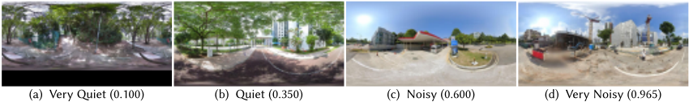

Table 6 compares the performances of different finetuned CNN models with four zero-shot VLFMs. The results show that BLIP achieves the best accuracy and weighted F1 score among all VLFMs in the zero-shot learning setting. The performance of BLIP is comparable to those of AlexNet but is still slightly worse than the best model, ResNet18 and ResNet50. To further understand the classification accuracy of different models on each noise intensity class, we visualize the confusion matrices of all models in Figure 7. We can see that the predictions of OpenCLIP-L, OpenCLIP-B, and OpenFlamingo-9B are highly biased. OpenCLIP-L and OpenCLIP-B tend to classify most street view images as 'very quiet' while OpenFlamingo-9B classifies most images as 'very noisy'. On the other hand, only BLIP shows balanced and reasonable predictions on all four noise intensity classes, similar to those fine-tuned CNN models.

These results are very encouraging with zero-shot BLIP achieving comparable performance with fine-tuned models. We can observe from Figure 7g that BLIP has a general sense of the noisy intensity level of the target urban area, e.g., it mis-classifies most 'very noisy' areas as simply 'noisy'. This implies that BLIP understands noisy intensity levels on a different scale. For example, a 'very noisy' place annotated by a human interviewee in Singapore might not qualify as 'very' for BLIP, which might have seen many much noisier urban areas. To this end, BLIPis generally competent for this urban perception task. At the same time, we recognize that most of the open visual-language foundation models are still not powerful enough to connect visual features to their important yet nuanced semantics and concepts in urban studies. For example, when presented with a construction site in Figure 6d, we expect a VLFM to predict that this is a very noisy neighborhood. When seeing a large vegetation coverage in Figure 6d, a VLFM should associate this visual feature with the concept of 'quiet' in the language space. This study highlights the fact that the current VLFMs have certain capabilities in understanding the characteristics of urban neighborhoods given visual inputs. However, their ability is still generally not as strong as the current LLMs on language-only tasks. Furthermore, we think the urban perception task, as a classic task in urban geography, is more challenging than current visual question-answering tasks commonly used in VLFM research [49, 112] partly due to their partially subjective nature and the rarity of annotated datasets. This further emphasizes the unique challenges faced by foundation model research in GeoAI.

Fig. 7. Confusion matrices of all baselines and visual-language FMs on 𝑆𝑖𝑛𝑔𝑎𝑝𝑜𝑟𝑒𝑆𝑉𝐼 579 dataset.

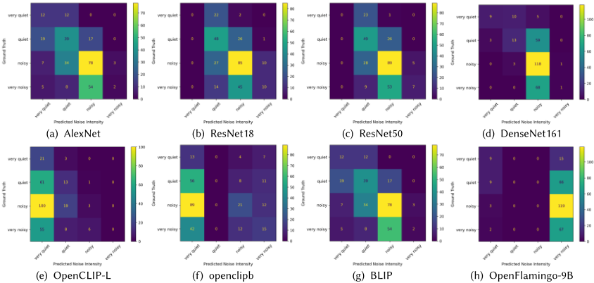

## 3.4 Remote Sensing

Our final experiment focuses on a typical remote sensing (RS) task - remote sensing image scene classification. We choose a widely-used aerial image scene classification dataset, 𝐴𝐼𝐷 [144], which consists of 10K scenes and 30 aerial scene types. These data were collected from Google Earth imagery. Please refer to Xia et al. [144] for a detailed description of this dataset. 𝐴𝐼𝐷 does not provide an official dataset split, so we split the dataset into training and testing sets using stratified sampling with a ratio of 80% for training and 20% for testing, ensuring that both sets have similar scene type label distributions.

Similar to the street view image classification task from Section 3.3.1, we use four CNN models (i.e., AlexNet, ResNet18, ResNet50, and DenseNet161) and four visual-language foundation models (i.e., OpenCLIP-L, OpenCLIP-B, BLIP, and OpenFlamingo-9B). For all CNNs models, their weights are first initialized by the ImageNet-V1 pre-trained weights, and their final softmax layers are fine-tuned with full supervision on the 𝐴𝐼𝐷 training dataset. For the VLFMs, their model performances are highly dependent on whether their language model component can correctly comprehend the semantics of each RS image scene type. However, many RS image scene types of 𝐴𝐼𝐷 are vague such as 'center', and 'commercial'. We find that if keeping their original scene type names, models like OpenCLIP would assign no RS image to those two types. Therefore, we modify the names of 'center' to 'theater' (although only partially covers the semantics of this class), and 'commercial' to 'commercial area' and use them in the prompt. Models with such prompts are denoted as ' ( 𝑈𝑝𝑑𝑎𝑡𝑒𝑑 ) ' while ' ( 𝑂𝑟𝑖𝑔𝑖𝑛 ) ' denotes the original RS image scene type names from 𝐴𝐼𝐷 being used in the prompt. We evaluate all VLFMs in a zero-shot learning setting. Following the street view image classification task in Section 3.3.1, similar prompt formats are used on the 𝐴𝐼𝐷 dataset.

Table 7 summarizes the experiment results of four fine-tuned CNNs models and zero-shot VLFMs. We can see that AlexNet achieves the best accuracy and F1 score among all CNN models. Surprisingly, OpenCLIP-L ( 𝑈𝑝𝑑𝑎𝑡𝑒𝑑 ) obtains the best accuracy and F1 score among all VLFMs. We observe that bigger models do not necessarily lead to better results in this task. For example, the largest model, OpenFlamingo-9B only achieves a 0.206 accuracy. One possible reason is that these larger VLFMs might not see remote-sensing images in their training data, which usually contain general web-crawled images and texts. OpenCLIP , on the other hand, explicitly includes satellite images in their pre-training data[54]. However, both BLIP and OpenFlamingo-9B did not mention whether they utilized remote sensing images during the pre-training stage. Note that street view images are quite similar to Internet images which are widely used for VLFM pre-training. RS images, on the other hand, such as satellite images and UAV (unmanned aerial vehicles), are visually distinguished from Internet photos where the majority of them are captured using consumers' digital cameras at the ground level. If the visual encoders of BLIP and OpenFlamingo-9B are not pre-trained on RS images, the features they extracted will not align well with text features that share similar semantics-this leads to poor performance on the 𝐴𝐼𝐷 dataset. Our study highlights the importance of pre-training VLFMs on a diverse set of visual inputs, including RS images, to improve their performance on remote sensing tasks.

Table 7. Evaluation results of various vision-language foundation models and baselines on the remote sensing image scene classification dataset, 𝐴𝐼𝐷 [144]. We use the same model set as Table 6. ' ( 𝑂𝑟𝑖𝑔𝑖𝑛 ) ' denotes we use the original remote sensing image scene class name from 𝐴𝐼𝐷 to populate the prompt while ' ( 𝑈𝑝𝑑𝑎𝑡𝑒𝑑 ) 'indicates we update some class names to improve its semantic interpretation for FMs. We use accuracy and F1 score as evaluation metrics.

|                           | Model                                               | #Param   |   Accuracy |    F1 |
|---------------------------|-----------------------------------------------------|----------|------------|-------|
| Supervised Finetuned CNNs | AlexNet [74]                                        | 58M      |      0.831 | 0.827 |
| Supervised Finetuned CNNs | ResNet18 [37]                                       | 11M      |      0.752 | 0.730 |
| Supervised Finetuned CNNs | ResNet50 [37]                                       | 24M      |      0.757 | 0.738 |
| Supervised Finetuned CNNs | DenseNet161 [48]                                    | 27M      |      0.818 | 0.807 |
|                           | OpenCLIP-L ( 𝑂𝑟𝑖𝑔𝑖𝑛 ) [54, 113, 127]                | 427M     |      0.708 | 0.688 |
|                           | OpenCLIP-L ( 𝑈𝑝𝑑𝑎𝑡𝑒𝑑 ) [54, 113, 127]               | 427M     |      0.710 | 0.698 |
|                           | OpenCLIP-B ( 𝑂𝑟𝑖𝑔𝑖𝑛 ) [54, 113, 127]                | 2.5B     |      0.699 | 0.668 |
|                           | Zero-shot FMs OpenCLIP-B ( 𝑈𝑝𝑑𝑎𝑡𝑒𝑑 ) [54, 113, 127] | 2.5B     |      0.705 | 0.686 |
|                           | BLIP ( 𝑂𝑟𝑖𝑔𝑖𝑛 ) [82]                                | 2.5B     |      0.500 | 0.473 |
|                           | BLIP ( 𝑈𝑝𝑑𝑎𝑡𝑒𝑑 ) [82]                               | 2.5B     |      0.520 | 0.494 |
|                           | OpenFlamingo-9B [11]                                | 8.3B     |      0.206 | 0.154 |

Another important observation is that the semantics embedded in the prompts play a pivotal role in determining the model's performance. For example, when using the original scene type name 'center', generally none of the models is able to understand the underlying ambiguous meaning. However, simply changing 'center' to 'theater' could help OpenCLIP correctly find relevant RS scenes, although this is not a perfect name to describe this class. Nevertheless, this simple change demonstrates the importance of choosing expressive prompts while using FMs for geospatial tasks.

Compared with the results in Table 5, the experimental results in Table 7 highlight the unique challenges of remote sensing images. We will discuss the improvement of FMs for remote sensing in detail in Section 4.4.

## 4 A MULTIMODAL FOUNDATION MODEL FOR GEOAI

Section 3 explores the effectiveness of applying existing FMs on different tasks from various geospatial domains. We can see that many large language models can outperform fully-supervised task-specific ML/DL models and achieve surprisingly good performances on several geospatial tasks such as toponym recognition, location description recognition, and time series forecasting of dementia. However, on other geospatial tasks (i.e., the two tested Urban Geography tasks and one RS task), especially those that involve multiple data modalities (e.g., point data, street view images, RS

images, etc.), existing foundation models still underperform task-specific models. In fact, one unique characteristic of many geospatial tasks is that they involve many data modalities such as text data, knowledge graphs, remote sensing images, street view images, trajectories, and other geospatial vector data. This will put a significant challenge on GeoAI foundation model development. So in this section, we discuss the challenges unique to each data modality, then propose a potential framework for future GeoAI which leverages a multimodal FM.

## 4.1 Geo-Text Data

Despite the promising results showed in Table 1, LLMs still struggle with more complex geospatial semantics tasks such as toponym resolution/geoparsing [7, 33, 134] and geographic question answering (GeoQA) [94, 97], since LLMs are unable to perform (implicit) spatial reasoning in a way that is grounded in the real world. As a concrete example, we illustrate the shortcomings of GPT-3 on a geoparsing task. Using two examples from the Ju2016 dataset, we ask GPT-3 to both: 1) recognize toponyms; and 2) predict their geo-coordinates. The prompt is shown in List 6 while the geoparsing results are visualized in Figure 8. We see that in both cases, GPT-3 can correctly recognize the toponyms but the predicted coordinates are 500+ miles away from the ground truth. Moreover, we notice that with a small spatial displacement of the generated geo-coordinates, GPT-3's log probability for this new pair of coordinates decreases significantly. In other words, the probability of coordinates generated by the LLM does not follow Tobler's First Law of Geography [130]. GPT-3 also generates invalid latitudinal/longitudinal coordinates, indicating that existing LLMs are still far from gracefully handling complex numerical and spatial reasoning tasks.

Figure 9 provides another example of unsatisfactory results of LLMs in answering geographic questions related to spatial relations. In this example, Monore, in the generated answer by the ChatGPT generated answer is not in the north of Athens, GA, but in the southwest of Athens. This example indicates that LLMs do not fully understand the semantics of spatial relation. The reason for this error could be that ChatGPT generates answers to this spatial relation question based on searching through its internal memory of text-based knowledge rather than performing spatial reasoning. One potential solution to this problem could be the use of geospatial knowledge graphs[18, 166], which can guide the LLMs to perform explicit spatial relation computations. We will discuss this further in the next section.

(a) [TEXT]: Franklin is a city in and the county seat of simpson county, ... (b) [TEXT]: the city of Fairview had a population of 260 as of july 1, 2015. ...

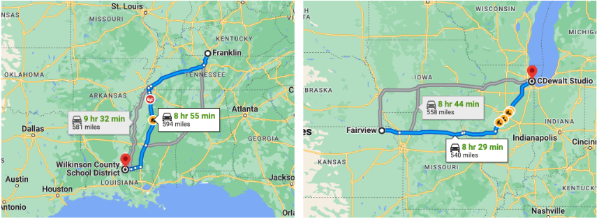

Fig. 8. Geoparsing examples of GPT-3 on the Ju2016 dataset comparing the predicted coordinates (dropped pins) and the ground truth coordinates (starting points). The recognized toponyms are underlined in text.

## 4.2 Geospatial Knowledge Graph

Despite the superior end-to-end prediction and generation capability, LLMs may produce content that lacks sufficient coverage of factual knowledge or even contains non-factual information. To address this problem, knowledge graphs (KGs) can serve as effective sources of information that complement LLMs. KGs are factual in nature because the information is usually extracted from reliable sources, with post-processing conducted by human editors to further ensure incorrect content is removed. As an important type of domain knowledge graphs, geospatial knowledge graphs (GeoKG) such as GeoNames [2], LinkedGeoData [10], YAGO2 [42], GNIS-LD [122], KnowWhereGraph [56], EVKG [111], etc. are usually generated from authoritative data sources and spatial databases. For example, GNIS-LD was constructed based on USGS's Geographic Names Information System (GNIS). This ensures the authenticity of these geospatial data.

In particular, developing multimodal FMs for GeoAI which jointly consider text data and geospatial knowledge graphs can lead to several advantages. First, from the model perspective, (geospatial) knowledge graphs could be integrated into pre-training or fine-tuning LLMs, through strategies such as retrieving embeddings of knowledge entities for contextual representation learning [110], fusing knowledge entities and text information [38, 158], designing learning objectives that focus on reconstructing knowledge entities [161] and triples [148]. Second, from the data perspective, GeoKGs could provide contextualized semantic and spatiotemporal knowledge to facilitate prompt engineering or data generation, such as enriching prompts with contextual information from KGs [14, 142] and converting KG triples into natural text corpora for specific domains [1]. Third, from the application perspective, it is possible to convert facts in geospatial knowledge graphs into natural language to enhance text generation [150], to be used in scenarios such as (geographic) question answering [29, 96] and dialogue systems [141]. Last, from a reasoning perspective, GeoKGs usually provide spatial footprints of geographic entities which enable LLMs to perform explicit spatial reasoning as Neural Symbolic Machine did [84]. This can help avoid the errors we see in Figure 9.

## 4.3 Street View Image

Section 3.3.1 has demonstrated the effectiveness of existing visual-language foundation models on a street view-based geospatial task. However, the performance gaps between the task-specific models and VLFMs shown in Table 6 inform us that there are some unique characteristics of urban perception tasks we need to consider if we want to develop a FM for GeoAI.

Listing 6. Geoparsing with LLMs, e.g., GPT-3. Yellow block: the text snippet to be geoparsed. Orange box: GPT-3 outputs.

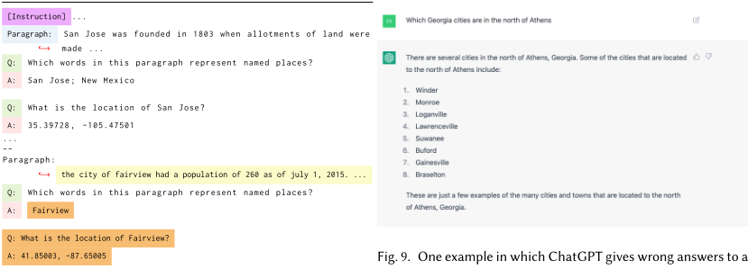

Fig. 9. One example in which ChatGPT gives wrong answers to a geographic question about topological relations. In this example, Monore is not in the north, but the southwest of Athens, GA.

Although street view images are like the natural images used in common vision-language tasks, one major difference is that common vision-language tasks usually focus on factual knowledge in images (e.g., ' how many cars in this image ') while urban perception tasks are usually related to high-level human perception of the images such as the safety, poverty, beauty, and sound intensity of a neighborhood given a street view image. Compared with factual knowledge, this kind of high-level perception knowledge is rather hard to estimate and the labels are rather rare. Moreover, many perception concepts are vague and subjective which increases the difficulties of those tasks. So in order to develop a GeoAI FM that can achieve state-of-the-art performances on various urban perception tasks, we need to conduct some domain studies to provide a concrete definition of each urban perception concept and develop some annotated datasets for GeoAI FM pre-training.

## 4.4 Remote Sensing

With the advancement of computer vision technology, deep vision models have been successfully applied to different kinds of remote sensing (RS) tasks including image classification/regression [12, 123], land cover classification [12], and object detection[76]. Unlike the usual vision tasks which usually work on RGB images, RS tasks are based on multispectral/hyperspectral images from different sensors. Most existing RS works focus on training one model for a specific RS task using data from a specific sensor [76]. Researchers often compare performances of different models using the same training datasets and decide on model implementation based on accuracy statistics. However, we see the trend of FMs in the CV field such as CLIP [112], Flamingo-9B [6] to be further developed to meet the unique challenges of remote sensing tasks. RS experiments in Section 3.4 demonstrate that there is still a performance gap between current visual-language foundation models and task-specific deep models. To fill this gap and develop a GeoAI FM that can achieve state-of-the-art performances on various RS tasks, we need to consider the uniqueness of RS images and tasks.

Aside from being task-agnostic , the desiderata for a remote sensing FM include being: 1) sensor-agnostic : it can seamlessly reason among RS images from different sensors with different spatial or spectral resolutions; 2) spatiotemporally-aware : it can handle the spatiotemporal metadata of RS images and perform geospatial reasoning for tasks such as image geolocalization and object tracking; 3) environmentally-invariant : it can decompose and isolate the spectral characteristics of the objects of interest across a variety of background environmental conditions and landscape structure. Recent developments here include geography-aware RS models [12] or self-supervised/unsupervised RS models [12, 123], all of which are task-agnostic. However, we have yet to develop a FM for RS tasks which can satisfy all such properties.

In summary, efforts should be focused on developing GeoAI FMs using remote sensing to address pressing environmental challenges due to climate change. It would require complex models which look beyond image classification toward modeling ecosystem functions such as forest structure, carbon sequestration, urban heat, coastal flooding, and wetland health. Traditionally remote sensing is widely used to study these phenomena but in a site-specific and sensor-specific manner. Sensor-agnostic, spatiotemporally-aware, and environmentally-invariant FMs have the potential to transform our understanding of the trends and behavior of these complex environmental phenomena.

## 4.5 Trajectory and Human Mobility

Trajectory, which is a sequence of time-ordered location tuples, is another important data type in GeoAI. The proliferation of digital trajectory data generated from various sensors (e.g., smartphones, wearable devices, and vehicle on-board devices) together with the advancement of deep learning approaches has enabled novel GeoAI models for modeling human mobility patterns, which are crucial for city management and transportation services, etc. There are four typical tasks in modeling human dynamics with deep learning [90], including trajectory generation [22, 118], origin-destination (OD) flow generation [129, 146], in/out population flow prediction [59, 83], and next-location/place prediction [85, 119].

In order to develop GeoAI FMs for supporting human mobility analysis, we need to consider the following perspectives: 1) pre-training and generation of task-agnostic trajectory embedding [101, 136], which represent high-level movement semantics (e.g., spatiotempporal awareness, routes, and location sequence) from various kinds of trajectories [85]; 2) context-aware contrastive learning of trajectory: human movements are constrained from their job type, surrounding built environment, and transportation infrastructure as well as many other spatiotemporal and environmental factors [90, 128, 137]; GeoAI FMs should be able to link trajectories to various contextual representations such as road networks (e.g., Road2Vec [86], [21]), POI composition or land use types [155], urban morphology [20], and population distribution [53]; 3) user geoprivacy [70] should be protected when training such GeoAI FMs since trajectory data can reveal individuals' sensitive locations such as home and personal trips. The privacy-preserving techniques by utilizing cryptography or differential privacy [5] and federated learning framework may be incorporated in the GeoAI FMs training process for trajectories [119].

## 4.6 Geospatial Vector Data

Another critical challenge in developing FMs for GeoAI is the complexity of geospatial vector data which are commonly used in almost all GIS and mapping platforms. Examples include the US state-level and county-level dementia data (polygon data) discussed in Section 3.2, urban POI data (point and polygon data) introduced in Section 3.3.1, cartographic polyline data [149], building footprints data [98], road networks (composed by points and polylines), and many others. In contrast with NLP and CV where text (1-D) or images (2-D) are well-structured and more suitable to common neural network architectures, vector data exhibits more complex data structures in the form of points, polylines, polygons, and networks [95]. So it is particularly challenging to develop a FM which can seamlessly encode or decode different kinds of vector data.

Noticeably, recently developed location encoding [91, 95], polyline encoding [118, 149], and polygon encoding techniques[98] can be seen as a fundamental building block for such a model. Moreover, since encoding (e.g., geo-aware image classification[91]) or decoding (e.g., geoparsing [134]) geospatial vector data, or conducting spatial reasoning (e.g., GeoQA [97]) is an indispensable component for most GeoAI tasks, developing FMs for vector data is the key step towards a multimodal FM for GeoAI. This point also differentiates GeoAI FMs from existing FMs in other domains.

## 4.7 A Multimodal FM for GeoAI

Except for those data modalities, there are also other datasets frequently studied in GeoAI such as geo-tagged videos, spatial social networks, sensor networks, and so on. Given all these diverse data modalities, the question is how to develop a multimodal FM for GeoAI that best integrates all of them.

When we take a look at the existing multimodal FMs such as CLIP [112], DALL · E2 [117], MDETR [63], VATT [3], BLIP [82], DeepMind Flamingo [6], KOSMOS-1 [49], we can see the following general architecture: 1) starting with separate embedding modules to encode different modalities of data (e.g., a Transformer for texts and ViT for images [112]); 2) (optionally) mixing the representations of different modalities by concatenation; 3) (optionally) more Transformer layers for across modality reasoning, which can achieve a certain degree of alignment based on semantics, e.g., the word 'hospital' attending to a picture of a hospital; 4) generative or discriminative prediction modules for different modalities to achieve self-supervised training.

Fig. 10. A multimodal FM which achieves alignment among different data sources via their geospatial relationships.

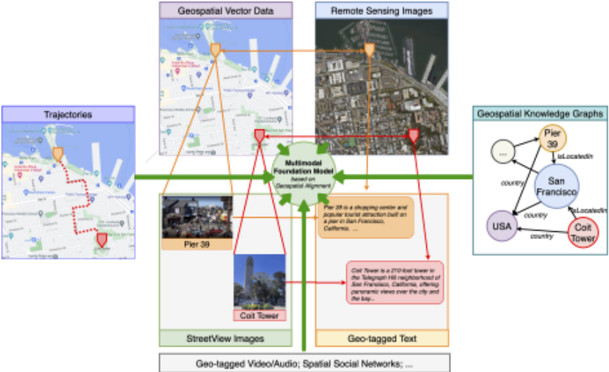

One weak point of these architectures is the lack of integration with geospatial vector data, which is the backbone of spatial reasoning and helps alignment among multi-modalities in GeoAI. This is considered central and critical for GeoAI tasks. Therefore, we propose to replace step 2 with aligning the representations of different modalities (e.g., geo-tagged texts and RS images) by augmenting their representations with location encoding[91] before mixing them. Figure 10 illustrates this idea. Geo-tagged text data, street view images, remote sensing images, trajectories, and geospatial knowledge graphs can be easily aligned via their geographic footprints (vector data). The key advantages of such a model are to enable spatial reasoning and knowledge transfer across modalities.

## 5 RISKS AND CHALLENGES

Despite the recent progress, several challenges are emerging as more advanced FMs have been released [163]. First, as FMs continue to increase in size, there is a need to improve the computational efficiency for training and fine-tuning these models. Second, as an increasing number of LLMs are not open-sourced, it becomes challenging to incorporate knowledge into these models without accessing to their internal parameters. Third, as LLMs are increasingly deployed in remote third-party settings, protecting user privacy becomes increasingly important.

Except for these challenges for FMs in general, there are also many unique challenges and risks during the process of GeoAI FMs development.

## 5.1 Geographic Fidelity

Many FMs are criticized for generating inaccurate and misleading results [50, 132]. In a geographic context, generating geographic faithful results is particularly important for almost all GeoAI tasks. In addition to Figure 9 in Section 4.1, Figure 11 illustrates two geographically inaccurate results generated from ChatGPT and Stable Diffusion. In Figure 11a, the expected answer should be ' Washington, North Carolina ' 11 . However, ChatGPT indicates there is no Washington in North Carolina. Moreover, the largest city in Washington State should be Seattle and there is no city in this state named Washington. Figure 11b visualizes 4 generated remote sensing images generated by Stable Diffusion 12 . Although those images appear similar to satellite images, it is rather easy to tell that they are fake RS images since the layouts of geographic features in these images are clearly not from any city in the world. In fact, generating faithful RS images is a popular and important RS task [34, 39] in which geometric accuracy is very important for the downstream tasks.

Fig. 11. Some geographically inaccurate results generated from different language and vision foundation models. (a) The expected answer ' Washington, North Carolina ' is not generated correctly. Moreover, there is no city in the state of Washington. The largest city in Washington State should be Seattle. (b) The generated remote sensing images from Stable Diffusion do not have correct geographic layouts such as road networks, waterbodies, etc.

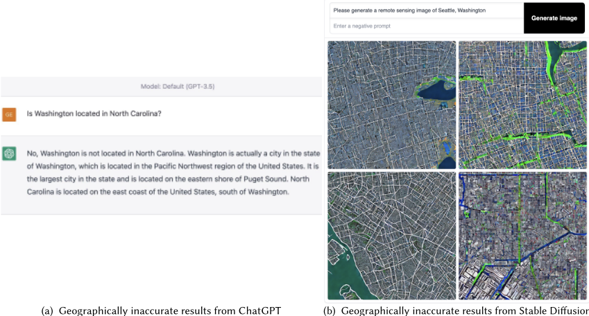

## 5.2 Geographic Bias

It is well known that foundation models have the potential to amplify existing societal inequalities and biases present in the data [13, 132, 157]. A key consideration for GeoAI in particular is geographic bias [87], which is often overlooked by AI research. For example, Zilong et al. [87] showed that all current geoparsers are highly geographically biased towards data-rich regions. The same issue can be observed in current LLMs. Figure 12 shows two examples in which both ChatGPT and GPT-4 generate inaccurate results due to the geographic bias inherited in these models. Compared with San Jose, California, USA , San Jose, Batangas 13 is a less popular place name in many text corpus. Similarly, compared with Washington State, USA and Washington, D.C., USA , Washington, New York 14 is also a less popular place name. That is why both ChatGPT and GPT-4 interpret those place names incorrectly. Compared to task-specific models, FMs suffer more from geographic bias since: 1) the training data is collected in large-scale which is likely to be dominated by bias

[11 https://en.wikipedia.org/wiki/Washington,\_North\_Carolina](https://en.wikipedia.org/wiki/Washington,_North_Carolina)

[12 https://huggingface.co/spaces/stabilityai/stable-diffusion](https://huggingface.co/spaces/stabilityai/stable-diffusion)

[13 https://en.wikipedia.org/wiki/San\_Jose,\_Batangas](https://en.wikipedia.org/wiki/San_Jose,_Batangas)

[14 https://en.wikipedia.org/wiki/Washington,\_New\_York](https://en.wikipedia.org/wiki/Washington,_New_York)

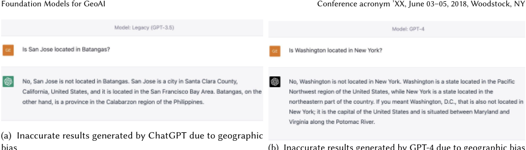

(b)

Inaccurate results generated by GPT-4 due to geographic bias

Fig. 12. Some inaccurate results generated from different ChatGPT and GPT-4 due to geographic bias. (a) San Jose, California, USA is a more popular place name compared with San Jose, Batangas . So ChatGPT interprets the name ' San Jose ' incorrectly and leads to a wrong answer. (b) Washington State, USA and Washington, D.C., USA are two popular places with name ' Washington '. The correct answer ' Washington, New York ' is less popular which leads to an inaccurate answer.


(a) Inaccurate results generated by ChatGPT due to temporal bias (b) Inaccurate results generated by GPT-4 due to temporal bias

Fig. 13. Some inaccurate results generated from GPT-4 due to temporal bias. (a) Flagler Beach, Florida used to be named as Ocean City during 1913 - 1923 while Ocean City, Florida now is used to call another place in Florida. GPT-4 fails to recognize this and return a wrong answer. (b) Fountain City, Indiana was named by Newport during 1834 - 1878 while now Newport is used to call another city, Newport, Indiana in Vermillion County . GPT-4 fails to answer it correctly.

overrepresented communities or regions; 2) the huge number of learnable parameters and complex model structures make model interpretation and debiasing much more difficult; 3) the geographic bias of the FMs can be easily inherited by all the adapted models downstream [13], and thus bring much more harm to the society. This indicates a pressing need for designing proper (geographic) debiasing frameworks.

## 5.3 Temporal Bias

Similar to geographic bias, FMs also suffer from temporal bias since there is much more training data available for current geographic entities than for historical ones Temporal bias can also lead to inaccurate results. Two examples are shown in Figure 13. In both cases, the names of historical places are used for other places nearby. GPT-4 fails to answer both questions due to its heavy reliance on pre-training data which are biased towards current geographic knowledge. Temporal bias and geographic bias are critical challenges that need to be solved for the development of GeoAI FMs.

## 5.4 Spatial Scale

Geographic information can be represented in different spatial scales, which means that the same geographic phenomenon/object can have completely different spatial representations (points vs. polygons) across GeoAI tasks. For example, an urban traffic forecasting model must represent San Francisco (SF) as a complex polygon, while a geoparser usually represents SF as a single point. Since FMs are developed for a diverse set of downstream tasks, they need to be able to handle geospatial information with different spatial scales, and infer the right spatial scale to use given a downstream task. Developing such a module is a critical component for an effective GeoAI FM.

## 5.5 Generalizability v.s. Spatial Heterogeneity

An open problem for GeoAI is how to achieve model generalizability ('replicability' [31]) across space while still allowing the model to capture spatial heterogeneity. Given geospatial data with different spatial scales, we desire a FM that can learn general spatial trends while still memorizing location-specific details. Will this generalizability introduce unavoidable intrinsic model bias in downstream GeoAI tasks? Will this memorized localized information lead to an overly complicated prediction surface for a global prediction problem? With large-scale training data, this problem can be amplified and requires care .

## 6 CONCLUSION

In this paper, we explore the promises and challenges for developing multimodal foundation models (FMs) for GeoAI. The potential of FMs is demonstrated by comparing the performance of existing LLMs and visual-language FMs as zero-shot or few-shot learners with fully-supervised task-specific SOTA models on seven tasks across multiple geospatial subdomains such as Geospatial Semantics, Health Geography, Urban Geography, and Remote Sensing. While in some language-only geospatial tasks, LLMs, as zero-shot or few-shot learners, can outperform task-specific fully-supervised models, existing FMs still underperform the task-specific fully-supervised models on other geospatial tasks, especially tasks involving multiple data modalities (e.g., POI-based urban function classification, street view image-based urban noise intensity classification, and remote sensing image scene classification). We realize that the major challenge for developing a FM for GeoAI is the multimodality nature of geospatial tasks. After discussing the unique challenges of each geospatial data modality, we propose our vision for a novel multimodal FM for GeoAI that should be pre-trained based on the alignment among different data modalities via their geospatial relations. We conclude this work by discussing some unique challenges and risks for such a model.

## REFERENCES

- [1] Oshin Agarwal, Heming Ge, Siamak Shakeri, and Rami Al-Rfou. 2021. Knowledge Graph Based Synthetic Corpus Generation for KnowledgeEnhanced Language Model Pre-training. In Proceedings of the 2021 Conference of the North American Chapter of the Association for Computational Linguistics: Human Language Technologies . Association for Computational Linguistics, 3554-3565.
- [2] Dirk Ahlers. 2013. Assessment of the accuracy of GeoNames gazetteer data. In Proceedings of the 7th workshop on geographic information retrieval . 74-81.
- [3] Hassan Akbari, Liangzhe Yuan, Rui Qian, Wei-Hong Chuang, Shih-Fu Chang, Yin Cui, and Boqing Gong. 2021. Vatt: Transformers for multimodal self-supervised learning from raw video, audio and text. Advances in Neural Information Processing Systems 34 (2021), 24206-24221.
- [4] Igor Akushevich, Arseniy P Yashkin, Anatoliy I Yashin, and Julia Kravchenko. 2021. Geographic disparities in mortality from Alzheimer's disease and related dementias. Journal of the American Geriatrics Society 69, 8 (2021), 2306-2315.
- [5] Mohammad Al-Rubaie and J Morris Chang. 2019. Privacy-preserving machine learning: Threats and solutions. IEEE Security &amp; Privacy 17, 2 (2019), 49-58.
- [6] Jean-Baptiste Alayrac, Jeff Donahue, Pauline Luc, Antoine Miech, Iain Barr, Yana Hasson, Karel Lenc, Arthur Mensch, Katie Millican, Malcolm Reynolds, Roman Ring, Eliza Rutherford, Serkan Cabi, Tengda Han, Zhitao Gong, Sina Samangooei, Marianne Monteiro, Jacob Menick, Sebastian

Borgeaud, Andy Brock, Aida Nematzadeh, Sahand Sharifzadeh, Mikolaj Binkowski, Ricardo Barreira, Oriol Vinyals, Andrew Zisserman, and Karen Simonyan. 2022. Flamingo: a Visual Language Model for Few-Shot Learning. ArXiv abs/2204.14198 (2022).

- [7] Beatrice Alex et al. 2015. Adapting the Edinburgh geoparser for historical georeferencing. International Journal of Humanities and Arts Computing 9, 1 (2015).
- [8] Alzheimer's Association et al. 2021. Changing the trajectory of Alzheimer's disease: how a treatment by 2025 saves lives and dollars. 2015. URL: https://www. alz. org/media/Documents/changing-the-trajectory-r. pdf [accessed 2018-07-18][WebCite Cache ID 710WNv2LM] (2021).
- [9] Alzheimer's Association et al. 2022. Alzheimer's disease facts and figures. More Than Normal Aging: Understanding Mild Cognitive Impairment. Alzheimer's Association.
- [10] Sören Auer, Jens Lehmann, and Sebastian Hellmann. 2009. Linkedgeodata: Adding a spatial dimension to the web of data. In The Semantic Web-ISWC 2009: 8th International Semantic Web Conference, ISWC 2009, Chantilly, VA, USA, October 25-29, 2009. Proceedings 8 . Springer, 731-746.
- [11] Anas Awadalla, Irena Gao, Joshua Gardner, Jack Hessel, Yusuf Hanafy, Wanrong Zhu, Kalyani Marathe, Yonatan Bitton, Samir Gadre, Jenia Jitsev, Simon Kornblith, Pang Wei Koh, Gabriel Ilharco, Mitchell Wortsman, and Ludwig Schmidt. 2023. OpenFlamingo . https://doi.org/10.5281/zenodo. 7733589
- [12] Kumar Ayush et al. 2021. Geography-aware self-supervised learning. In CVPR 2021 . 2021 IEEE/CVF International Conference on Computer Vision (ICCV), 10181-10190.
- [13] Rishi Bommasani, Drew A Hudson, Ehsan Adeli, Russ Altman, Simran Arora, Sydney von Arx, Michael S Bernstein, Jeannette Bohg, Antoine Bosselut, Emma Brunskill, et al. 2021. On the opportunities and risks of foundation models. arXiv preprint arXiv:2108.07258 (2021).
- [14] Ryan Brate, Minh-Hoang Dang, Fabian Hoppe, Yuan He, Albert Meroño-Peñuela, and Vijay Sadashivaiah. 2022. Improving Language Model Predictions via Prompts Enriched with Knowledge Graphs. In Workshop on Deep Learning for Knowledge Graphs (DL4KG@ ISWC2022) .
- [15] Tom Brown, Benjamin Mann, Nick Ryder, Melanie Subbiah, Jared D Kaplan, Prafulla Dhariwal, Arvind Neelakantan, Pranav Shyam, Girish Sastry, Amanda Askell, et al. 2020. Language models are few-shot learners. Advances in neural information processing systems 33 (2020), 1877-1901.
- [16] Marshall Burke, Anne Driscoll, David B Lobell, and Stefano Ermon. 2021. Using satellite imagery to understand and promote sustainable development. Science 371, 6535 (2021), eabe8628.
- [17] Ling Cai, Krzysztof Janowicz, Gengchen Mai, Bo Yan, and Rui Zhu. 2020. Traffic transformer: Capturing the continuity and periodicity of time series for traffic forecasting. Transactions in GIS 24, 3 (2020), 736-755.
- [18] Ling Cai, Krzysztof Janowicz, Rui Zhu, Gengchen Mai, Bo Yan, and Zhangyu Wang. 2022. HyperQuaternionE: A hyperbolic embedding model for qualitative spatial and temporal reasoning. GeoInformatica (2022), 1-39.
- [19] Serina Chang, Emma Pierson, Pang Wei Koh, Jaline Gerardin, Beth Redbird, David Grusky, and Jure Leskovec. 2021. Mobility network models of COVID-19 explain inequities and inform reopening. Nature 589, 7840 (2021), 82-87.
- [20] Wangyang Chen, Abraham Noah Wu, and Filip Biljecki. 2021. Classification of urban morphology with deep learning: Application on urban vitality. Computers, Environment and Urban Systems 90 (2021), 101706.
- [21] Yile Chen, Xiucheng Li, Gao Cong, Zhifeng Bao, Cheng Long, Yiding Liu, Arun Kumar Chandran, and Richard Ellison. 2021. Robust road network representation learning: When traffic patterns meet traveling semantics. In Proceedings of the 30th ACM International Conference on Information &amp; Knowledge Management . 211-220.
- [22] Seongjin Choi, Jiwon Kim, and Hwasoo Yeo. 2021. Trajgail: Generating urban vehicle trajectories using generative adversarial imitation learning. Transportation Research Part C: Emerging Technologies 128 (2021), 103091.
- [23] Grant DeLozier, Benjamin Wing, Jason Baldridge, and Scott Nesbit. 2016. Creating a novel geolocation corpus from historical texts. In LAW-X 2016 . 188-198.
- [24] Jia Deng, Wei Dong, Richard Socher, Li-Jia Li, Kai Li, and Li Fei-Fei. 2009. Imagenet: A large-scale hierarchical image database. In 2009 IEEE conference on computer vision and pattern recognition . Ieee, 248-255.
- [25] Alexey Dosovitskiy, Lucas Beyer, Alexander Kolesnikov, Dirk Weissenborn, Xiaohua Zhai, Thomas Unterthiner, Mostafa Dehghani, Matthias Minderer, Georg Heigold, Sylvain Gelly, Jakob Uszkoreit, and Neil Houlsby. 2021. An Image is Worth 16x16 Words: Transformers for Image Recognition at Scale. ICLR (2021).
- [26] Shouji Du, Shihong Du, Bo Liu, and Xiuyuan Zhang. 2019. Context-enabled extraction of large-scale urban functional zones from very-highresolution images: A multiscale segmentation approach. Remote Sensing 11, 16 (2019), 1902.
- [27] Shouji Du, Shihong Du, Bo Liu, Xiuyuan Zhang, and Zhijia Zheng. 2020. Large-scale urban functional zone mapping by integrating remote sensing images and open social data. GIScience &amp; Remote Sensing 57, 3 (2020), 411-430.
- [28] Amna Elmustafa, Erik Rozi, Yutong He, Gengchen Mai, Stefano Ermon, Marshall Burke, and David Lobell. 2022. Understanding economic development in rural Africa using satellite imagery, building footprints and deep models. In Proceedings of the 30th International Conference on Advances in Geographic Information Systems . ACM, 1-4.
- [29] Angela Fan, Claire Gardent, Chloé Braud, and Antoine Bordes. 2019. Using Local Knowledge Graph Construction to Scale Seq2Seq Models to Multi-Document Inputs. In 2019 Conference on Empirical Methods in Natural Language Processing and 9th International Joint Conference on Natural Language Processing .
- [30] Jenny Rose Finkel, Trond Grenager, and Christopher D Manning. 2005. Incorporating non-local information into information extraction systems by gibbs sampling. In Proceedings of the 43rd annual meeting of the association for computational linguistics (ACL'05) . 363-370.

- [31] Michael F Goodchild and Wenwen Li. 2021. Replication across space and time must be weak in the social and environmental sciences. PNAS 118, 35 (2021).
- [32] Ian Goodfellow, Jean Pouget-Abadie, Mehdi Mirza, Bing Xu, David Warde-Farley, Sherjil Ozair, Aaron Courville, and Yoshua Bengio. 2020. Generative adversarial networks. Commun. ACM 63, 11 (2020), 139-144.
- [33] Milan Gritta, Mohammad Taher Pilehvar, and Nigel Collier. 2018. Which Melbourne? Augmenting Geocoding with Maps. In ACL 2018 . 1285-1296.
- [34] Xiaolin Han, Huan Zhang, Jing-Hao Xue, and Weidong Sun. 2021. A spectral-spatial jointed spectral super-resolution and its application to HJ-1A satellite images. IEEE Geoscience and Remote Sensing Letters 19 (2021), 1-5.
- [35] Kotaro Hara, Jin Sun, Robert Moore, David Jacobs, and Jon Froehlich. 2014. Tohme: Detecting Curb Ramps in Google Street View Using Crowdsourcing, Computer Vision, and Machine Learning. In Proceedings of the 27th Annual ACM Symposium on User Interface Software and Technology (Honolulu, Hawaii, USA) (UIST '14) . Association for Computing Machinery, New York, NY, USA, 189-204. https://doi.org/10.1145/2642918.2647403
- [36] Kaiming He, Xiangyu Zhang, Shaoqing Ren, and Jian Sun. 2016. Deep residual learning for image recognition. In Proceedings of the IEEE conference on computer vision and pattern recognition . 770-778.
- [37] Kaiming He, Xiangyu Zhang, Shaoqing Ren, and Jian Sun. 2016. Deep residual learning for image recognition. In Proceedings of the IEEE conference on computer vision and pattern recognition . 770-778.
- [38] Lei He, Suncong Zheng, Tao Yang, and Feng Zhang. 2021. Klmo: Knowledge graph enhanced pretrained language model with fine-grained relationships. In Findings of the Association for Computational Linguistics: EMNLP 2021 . 4536-4542.
- [39] Yutong He, Dingjie Wang, Nicholas Lai, William Zhang, Chenlin Meng, Marshall Burke, David Lobell, and Stefano Ermon. 2021. Spatial-temporal super-resolution of satellite imagery via conditional pixel synthesis. Advances in Neural Information Processing Systems 34 (2021), 27903-27915.
- [40] Danny Hernandez, Jared Kaplan, Tom Henighan, and Sam McCandlish. 2021. Scaling Laws for Transfer. arXiv:2102.01293 [cs.LG]
- [41] Jonathan Ho, Ajay Jain, and Pieter Abbeel. 2020. Denoising diffusion probabilistic models. Advances in Neural Information Processing Systems 33 (2020), 6840-6851.
- [42] Johannes Hoffart, Fabian M Suchanek, Klaus Berberich, and Gerhard Weikum. 2013. YAGO2: A spatially and temporally enhanced knowledge base from Wikipedia. Artificial intelligence 194 (2013), 28-61.
- [43] Jordan Hoffmann, Sebastian Borgeaud, Arthur Mensch, Elena Buchatskaya, Trevor Cai, Eliza Rutherford, Diego de Las Casas, Lisa Anne Hendricks, Johannes Welbl, Aidan Clark, Tom Hennigan, Eric Noland, Katie Millican, George van den Driessche, Bogdan Damoc, Aurelia Guy, Simon Osindero, Karen Simonyan, Erich Elsen, Jack W. Rae, Oriol Vinyals, and Laurent Sifre. 2022. Training Compute-Optimal Large Language Models. CoRR abs/2203.15556 (2022).
- [44] Matthew Honnibal and Ines Montani. 2017. spaCy 2: Natural language understanding with Bloom embeddings, convolutional neural networks and incremental parsing. To appear 7, 1 (2017), 411-420.
- [45] Yingjie Hu, , et al. 2020. How Do People Describe Locations During a Natural Disaster: An Analysis of Tweets from Hurricane Harvey. In GIScience 2020 .
- [46] Yingjie Hu. 2018. Geo-text data and data-driven geospatial semantics. Geography Compass 12, 11 (2018), e12404.
- [47] Yingjie Hu et al. 2014. Improving wikipedia-based place name disambiguation in short texts using structured data from dbpedia. In GIR Workshop 2014 . 1-8.
- [48] Gao Huang, Zhuang Liu, Laurens Van Der Maaten, and Kilian Q Weinberger. 2017. Densely connected convolutional networks. In Proceedings of the IEEE conference on computer vision and pattern recognition . 4700-4708.
- [49] Shaohan Huang, Li Dong, Wenhui Wang, Yaru Hao, Saksham Singhal, Shuming Ma, Tengchao Lv, Lei Cui, Owais Khan Mohammed, Qiang Liu, et al. 2023. Language is not all you need: Aligning perception with language models. arXiv preprint arXiv:2302.14045 (2023).
- [50] Shaohan Huang, Li Dong, Wenhui Wang, Yaru Hao, Saksham Singhal, Shuming Ma, Tengchao Lv, Lei Cui, Owais Khan Mohammed, Qiang Liu, et al. 2023. Language is not all you need: Aligning perception with language models. arXiv preprint arXiv:2302.14045 (2023).
- [51] Weiming Huang, Lizhen Cui, Meng Chen, Daokun Zhang, and Yao Yao. 2022. Estimating urban functional distributions with semantics preserved POI embedding. International Journal of Geographical Information Science 36, 10 (2022), 1905-1930.
- [52] Weiming Huang, Daokun Zhang, Gengchen Mai, Xu Guo, and Lizhen Cui. 2023. Learning urban region representations with POIs and hierarchical graph infomax. ISPRS Journal of Photogrammetry and Remote Sensing 196 (2023), 134-145.
- [53] Xiao Huang, Di Zhu, Fan Zhang, Tao Liu, Xiao Li, and Lei Zou. 2021. Sensing population distribution from satellite imagery via deep learning: Model selection, neighboring effects, and systematic biases. IEEE Journal of Selected Topics in Applied Earth Observations and Remote Sensing 14 (2021), 5137-5151.
- [54] Gabriel Ilharco, Mitchell Wortsman, Ross Wightman, Cade Gordon, Nicholas Carlini, Rohan Taori, Achal Dave, Vaishaal Shankar, Hongseok Namkoong, John Miller, Hannaneh Hajishirzi, Ali Farhadi, and Ludwig Schmidt. 2021. OpenCLIP . https://doi.org/10.5281/zenodo.5143773 If you use this software, please cite it as below..
- [55] Krzysztof Janowicz, Song Gao, Grant McKenzie, Yingjie Hu, and Budhendra Bhaduri. 2020. GeoAI: spatially explicit artificial intelligence techniques for geographic knowledge discovery and beyond. International Journal of Geographical Information Science 34, 4 (2020), 625-636.
- [56] Krzysztof Janowicz, Pascal Hitzler, Wenwen Li, Dean Rehberger, Mark Schildhauer, Rui Zhu, Cogan Shimizu, Colby K Fisher, Ling Cai, Gengchen Mai, et al. 2022. Know, Know Where, KnowWhereGraph: A densely connected, cross-domain knowledge graph and geo-enrichment service stack for applications in environmental intelligence. AI Magazine 43, 1 (2022), 30-39.

- [57] Krzysztof Janowicz, Simon Scheider, Todd Pehle, and Glen Hart. 2012. Geospatial semantics and linked spatiotemporal data-Past, present, and future. Semantic Web 3, 4 (2012), 321-332.
- [58] Gwilym M Jenkins, George EP Box, and Gregory C Reinsel. 2011. Time series analysis: forecasting and control . Vol. 734. John Wiley &amp; Sons.
- [59] Renhe Jiang, Zekun Cai, Zhaonan Wang, Chuang Yang, Zipei Fan, Quanjun Chen, Kota Tsubouchi, Xuan Song, and Ryosuke Shibasaki. 2021. Deepcrowd: A deep model for large-scale citywide crowd density and flow prediction. IEEE Transactions on Knowledge and Data Engineering 35, 1 (2021), 276-290.
- [60] Christopher B Jones and Ross S Purves. 2008. Geographical information retrieval. International Journal of Geographical Information Science 22, 3 (2008), 219-228.
- [61] Yiting Ju et al. 2016. Things and strings: improving place name disambiguation from short texts by combining entity co-occurrence with topic modeling. In EKAW 2016 . Springer, 353-367.
- [62] Dan Jurafsky and James H. Martin. 2009. Speech and language processing: an introduction to natural language processing, computational linguistics, and speech recognition, 2nd Edition . Prentice Hall, Pearson Education International.
- [63] Aishwarya Kamath, Mannat Singh, Yann LeCun, Gabriel Synnaeve, Ishan Misra, and Nicolas Carion. 2021. Mdetr-modulated detection for end-to-end multi-modal understanding. In Proceedings of the IEEE/CVF International Conference on Computer Vision . 1780-1790.
- [64] Minguk Kang, Jun-Yan Zhu, Richard Zhang, Jaesik Park, Eli Shechtman, Sylvain Paris, and Taesung Park. 2023. Scaling up gans for text-to-image synthesis. arXiv preprint arXiv:2303.05511 (2023).
- [65] Yuhao Kang, Fan Zhang, Wenzhe Peng, Song Gao, Jinmeng Rao, Fabio Duarte, and Carlo Ratti. 2021. Understanding house price appreciation using multi-source big geo-data and machine learning. Land Use Policy 111 (2021), 104919.
- [66] Jared Kaplan, Sam McCandlish, Tom Henighan, Tom B. Brown, Benjamin Chess, Rewon Child, Scott Gray, Alec Radford, Jeffrey Wu, and Dario Amodei. 2020. Scaling Laws for Neural Language Models. CoRR abs/2001.08361 (2020).
- [67] Tero Karras, Samuli Laine, and Timo Aila. 2019. A style-based generator architecture for generative adversarial networks. In Proceedings of the IEEE/CVF conference on computer vision and pattern recognition . 4401-4410.
- [68] Robin Kearns and Graham Moon. 2002. From medical to health geography: novelty, place and theory after a decade of change. Progress in human geography 26, 5 (2002), 605-625.
- [69] Jacob Devlin Ming-Wei Chang Kenton and Lee Kristina Toutanova. 2019. BERT: Pre-training of Deep Bidirectional Transformers for Language Understanding. In NAACL-HLT 2019 . 4171-4186.
- [70] Carsten Keßler and Grant McKenzie. 2018. A geoprivacy manifesto. Transactions in GIS 22, 1 (2018), 3-19.
- [71] Diederik P. Kingma and Max Welling. 2014. Auto-Encoding Variational Bayes. In 2nd International Conference on Learning Representations, ICLR 2014, Banff, AB, Canada, April 14-16, 2014, Conference Track Proceedings . arXiv:http://arxiv.org/abs/1312.6114v10 [stat.ML]
- [72] Alexander Kirillov, Eric Mintun, Nikhila Ravi, Hanzi Mao, Chloe Rolland, Laura Gustafson, Tete Xiao, Spencer Whitehead, Alexander C Berg, Wan-Yen Lo, et al. 2023. Segment Anything. arXiv preprint arXiv:2304.02643 (2023).
- [73] Ellen A Kramarow and Betzaida Tejada-Vera. 2019. Dementia mortality in the United States, 2000-2017. National Vital Statistics Reports: From the Centers for Disease Control and Prevention, National Center for Health Statistics, National Vital Statistics System 68, 2 (2019), 1-29.
- [74] Alex Krizhevsky, Ilya Sutskever, and Geoffrey E Hinton. 2017. Imagenet classification with deep convolutional neural networks. Commun. ACM 60, 6 (2017), 84-90.
- [75] Werner Kuhn. 2005. Geospatial semantics: why, of what, and how?. In Journal on data semantics III . Springer, 1-24.
- [76] Darius Lam, Richard Kuzma, Kevin McGee, Samuel Dooley, Michael Laielli, Matthew Klaric, Yaroslav Bulatov, and Brendan McCord. 2018. xview: Objects in context in overhead imagery. arXiv preprint arXiv:1802.07856 (2018).
- [77] Guillaume Lample, Miguel Ballesteros, Sandeep Subramanian, Kazuya Kawakami, and Chris Dyer. 2016. Neural architectures for named entity recognition. arXiv preprint arXiv:1603.01360 (2016).
- [78] Christian Ledig, Lucas Theis, Ferenc Huszár, Jose Caballero, Andrew Cunningham, Alejandro Acosta, Andrew Aitken, Alykhan Tejani, Johannes Totz, Zehan Wang, et al. 2017. Photo-realistic single image super-resolution using a generative adversarial network. In Proceedings of the IEEE conference on computer vision and pattern recognition . 4681-4690.
- [79] Jihyeon Lee, Nina R Brooks, Fahim Tajwar, Marshall Burke, Stefano Ermon, David B Lobell, Debashish Biswas, and Stephen P Luby. 2021. Scalable deep learning to identify brick kilns and aid regulatory capacity. Proceedings of the National Academy of Sciences 118, 17 (2021), e2018863118.
- [80] Jihyeon Lee, Dylan Grosz, Sicheng Zeng, Burak Uzkent, Marshall Burke, David Lobell, and Stefano Ermon. 2021. Predicting livelihood indicators from crowdsourced street level images. In Proceedings of the AAAI Conference on Artificial Intelligence .
- [81] Junnan Li, Dongxu Li, Silvio Savarese, and Steven Hoi. 2023. Blip-2: Bootstrapping language-image pre-training with frozen image encoders and large language models. arXiv preprint arXiv:2301.12597 (2023).
- [82] Junnan Li, Dongxu Li, Caiming Xiong, and Steven Hoi. 2022. Blip: Bootstrapping language-image pre-training for unified vision-language understanding and generation. In International Conference on Machine Learning . PMLR, 12888-12900.
- [83] Mingxiao Li, Song Gao, Feng Lu, Kang Liu, Hengcai Zhang, and Wei Tu. 2021. Prediction of human activity intensity using the interactions in physical and social spaces through graph convolutional networks. International Journal of Geographical Information Science 35, 12 (2021), 2489-2516.
- [84] Chen Liang, Jonathan Berant, Quoc Le, Kenneth Forbus, and Ni Lao. 2017. Neural Symbolic Machines: Learning Semantic Parsers on Freebase with Weak Supervision. In Proceedings of the 55th Annual Meeting of the Association for Computational Linguistics . 23-33.

- [85] Yan Lin, Huaiyu Wan, Shengnan Guo, and Youfang Lin. 2021. Pre-training context and time aware location embeddings from spatial-temporal trajectories for user next location prediction. In Proceedings of the AAAI Conference on Artificial Intelligence , Vol. 35. 4241-4248.
- [86] Kang Liu, Song Gao, Peiyuan Qiu, Xiliang Liu, Bo Yan, and Feng Lu. 2017. Road2vec: Measuring traffic interactions in urban road system from massive travel routes. ISPRS International Journal of Geo-Information 6, 11 (2017), 321.
- [87] Zilong Liu, Krzysztof Janowicz, Ling Cai, Rui Zhu, Gengchen Mai, and Meilin Shi. 2022. Geoparsing: Solved or Biased? An Evaluation of Geographic Biases in Geoparsing. AGILE: GIScience Series 3 (2022), 9.
- [88] Ze Liu, Yutong Lin, Yue Cao, Han Hu, Yixuan Wei, Zheng Zhang, Stephen Lin, and Baining Guo. 2021. Swin transformer: Hierarchical vision transformer using shifted windows. In Proceedings of the IEEE/CVF international conference on computer vision . 10012-10022.
- [89] Zhuang Liu, Hanzi Mao, Chao-Yuan Wu, Christoph Feichtenhofer, Trevor Darrell, and Saining Xie. 2022. A ConvNet for the 2020s. Proceedings of the IEEE/CVF Conference on Computer Vision and Pattern Recognition (CVPR) (2022).
- [90] Massimiliano Luca, Gianni Barlacchi, Bruno Lepri, and Luca Pappalardo. 2021. A survey on deep learning for human mobility. ACM Computing Surveys (CSUR) 55, 1 (2021), 1-44.
- [91] Gengchen Mai et al. 2020. Multi-Scale Representation Learning for Spatial Feature Distributions using Grid Cells. In ICLR 2020 . openreview.
- [92] Gengchen Mai, Chris Cundy, Kristy Choi, Yingjie Hu, Ni Lao, and Stefano Ermon. 2022. Towards a foundation model for geospatial artificial intelligence (vision paper). In Proceedings of the 30th International Conference on Advances in Geographic Information Systems . 1-4.
- [93] Gengchen Mai, Yingjie Hu, Song Gao, Ling Cai, Bruno Martins, Johannes Scholz, Jing Gao, and Krzysztof Janowicz. 2022. Symbolic and subsymbolic GeoAI: Geospatial knowledge graphs and spatially explicit machine learning. Transactions in GIS 26, 8 (2022), 3118-3124.
- [94] Gengchen Mai, Krzysztof Janowicz, Ling Cai, Rui Zhu, Blake Regalia, Bo Yan, Meilin Shi, and Ni Lao. 2020. SE-KGE: A Location-Aware Knowledge Graph Embedding Model for Geographic Question Answering and Spatial Semantic Lifting. Transactions in GIS 24, 3 (2020), 623-655.
- [95] Gengchen Mai, Krzysztof Janowicz, Yingjie Hu, Song Gao, Bo Yan, Rui Zhu, Ling Cai, and Ni Lao. 2022. A review of location encoding for GeoAI: methods and applications. International Journal of Geographical Information Science 36, 4 (2022), 639-673.
- [96] Gengchen Mai, Krzysztof Janowicz, Bo Yan, Rui Zhu, Ling Cai, and Ni Lao. 2019. Contextual graph attention for answering logical queries over incomplete knowledge graphs. In Proceedings of the 10th international conference on knowledge capture . 171-178.
- [97] Gengchen Mai, Krzysztof Janowicz, Rui Zhu, Ling Cai, and Ni Lao. 2021. Geographic question answering: challenges, uniqueness, classification, and future directions. AGILE: GIScience series 2 (2021), 8.
- [98] Gengchen Mai, Chiyu Jiang, Weiwei Sun, Rui Zhu, Yao Xuan, Ling Cai, Krzysztof Janowicz, Stefano Ermon, and Ni Lao. 2022. Towards generalpurpose representation learning of polygonal geometries. GeoInformatica (2022), 1-52.
- [99] Pablo N Mendes et al. 2011. DBpedia spotlight: shedding light on the web of documents. In I-Semantics 2011 .
- [100] Deepak R Mishra, Hyun J Cho, Shuvankar Ghosh, Amelia Fox, Christopher Downs, Paul BT Merani, Philemon Kirui, Nick Jackson, and Sachidananda Mishra. 2012. Post-spill state of the marsh: Remote estimation of the ecological impact of the Gulf of Mexico oil spill on Louisiana Salt Marshes. Remote Sensing of Environment 118 (2012), 176-185.
- [101] Mashaal Musleh, Mohamed F Mokbel, and Sofiane Abbar. 2022. Let's speak trajectories. In Proceedings of the 30th International Conference on Advances in Geographic Information Systems . 1-4.
- [102] Haifeng Niu and Elisabete A Silva. 2021. Delineating urban functional use from points of interest data with neural network embedding: A case study in Greater London. Computers, Environment and Urban Systems 88 (2021), 101651.
- [103] Gilles Notton and Cyril Voyant. 2018. Forecasting of intermittent solar energy resource. In Advances in Renewable Energies and Power Technologies . Elsevier, 77-114.
- [104] OpenAI. 2022. Introducing ChatGPT . https://openai.com/blog/chatgpt
- [105] OpenAI. 2023. GPT-4 Technical Report. arXiv preprint arXiv:2303.08774 (2023).
- [106] Long Ouyang, Jeffrey Wu, Xu Jiang, Diogo Almeida, Carroll Wainwright, Pamela Mishkin, Chong Zhang, Sandhini Agarwal, Katarina Slama, Alex Ray, et al. 2022. Training language models to follow instructions with human feedback. Advances in Neural Information Processing Systems 35 (2022), 27730-27744.
- [107] Marius Paulescu, Eugenia Paulescu, and Viorel Badescu. 2021. Nowcasting solar irradiance for effective solar power plants operation and smart grid management. In Predictive Modelling for Energy Management and Power Systems Engineering . Elsevier, 249-270.
- [108] Joel Pearson. 2019. The human imagination: the cognitive neuroscience of visual mental imagery. Nature reviews neuroscience 20, 10 (2019), 624-634.
- [109] Matthew E. Peters, Mark Neumann, Mohit Iyyer, Matt Gardner, Christopher Clark, Kenton Lee, and Luke Zettlemoyer. 2018. Deep Contextualized Word Representations. In NAACL-HLT2018 . Association for Computational Linguistics, New Orleans, Louisiana, 2227-2237.
- [110] Matthew E Peters, Mark Neumann, Robert Logan, Roy Schwartz, Vidur Joshi, Sameer Singh, and Noah A Smith. 2019. Knowledge Enhanced Contextual Word Representations. In Proceedings of the 2019 Conference on Empirical Methods in Natural Language Processing and the 9th International Joint Conference on Natural Language Processing (EMNLP-IJCNLP) . 43-54.
- [111] Yanlin Qi, Gengchen Mai, Rui Zhu, and Michael Zhang. 2023. EVKG: An Interlinked and Interoperable Electric Vehicle Knowledge Graph for Smart Transportation System. Transactions in GIS (2023).
- [112] Alec Radford, Jong Wook Kim, Chris Hallacy, Aditya Ramesh, Gabriel Goh, Sandhini Agarwal, Girish Sastry, Amanda Askell, Pamela Mishkin, Jack Clark, et al. 2021. Learning transferable visual models from natural language supervision. In International conference on machine learning . PMLR, 8748-8763.

- [113] Alec Radford, Jong Wook Kim, Chris Hallacy, Aditya Ramesh, Gabriel Goh, Sandhini Agarwal, Girish Sastry, Amanda Askell, Pamela Mishkin, Jack Clark, et al. 2021. Learning transferable visual models from natural language supervision. In International conference on machine learning . PMLR, 8748-8763.
- [114] Alec Radford, Karthik Narasimhan, Tim Salimans, and Ilya Sutskever. 2018. Improving language understanding by generative pre-training. (2018).
- [115] Alec Radford, Jeff Wu, Rewon Child, David Luan, Dario Amodei, and Ilya Sutskever. 2019. Language Models are Unsupervised Multitask Learners. (2019).
- [116] Colin Raffel, Noam Shazeer, Adam Roberts, Katherine Lee, Sharan Narang, Michael Matena, Yanqi Zhou, Wei Li, and Peter J. Liu. 2020. Exploring the Limits of Transfer Learning with a Unified Text-to-Text Transformer. Journal of Machine Learning Research 21, 140 (2020), 1-67.
- [117] Aditya Ramesh, Prafulla Dhariwal, Alex Nichol, Casey Chu, and Mark Chen. 2022. Hierarchical text-conditional image generation with clip latents. arXiv preprint arXiv:2204.06125 (2022).
- [118] Jinmeng Rao, Song Gao, Yuhao Kang, and Qunying Huang. 2020. LSTM-TrajGAN: A Deep Learning Approach to Trajectory Privacy Protection. In 11th International Conference on Geographic Information Science (GIScience 2021)-Part I . Schloss Dagstuhl-Leibniz-Zentrum für Informatik.
- [119] Jinmeng Rao, Song Gao, Mingxiao Li, and Qunying Huang. 2021. A privacy-preserving framework for location recommendation using decentralized collaborative machine learning. Transactions in GIS 25, 3 (2021), 1153-1175.
- [120] Joseph Redmon, Santosh Divvala, Ross Girshick, and Ali Farhadi. 2016. You only look once: Unified, real-time object detection. In Proceedings of the IEEE conference on computer vision and pattern recognition . 779-788.
- [121] Scott Reed, Konrad Zolna, Emilio Parisotto, Sergio Gomez Colmenarejo, Alexander Novikov, Gabriel Barth-Maron, Mai Gimenez, Yury Sulsky, Jackie Kay, Jost Tobias Springenberg, et al. 2022. A generalist agent. arXiv preprint arXiv:2205.06175 (2022).
- [122] Blake Regalia, Krzysztof Janowicz, Gengchen Mai, Dalia Varanka, and E Lynn Usery. 2018. GNIS-LD: Serving and visualizing the geographic names information system gazetteer as linked Data. In European Semantic Web Conference . Springer, 528-540.
- [123] Esther Rolf, Jonathan Proctor, Tamma Carleton, Ian Bolliger, Vaishaal Shankar, Miyabi Ishihara, Benjamin Recht, and Solomon Hsiang. 2021. A generalizable and accessible approach to machine learning with global satellite imagery. Nature communications 12, 1 (2021), 4392.
- [124] Robin Rombach, Andreas Blattmann, Dominik Lorenz, Patrick Esser, and Björn Ommer. 2022. High-resolution image synthesis with latent diffusion models. In Proceedings of the IEEE/CVF Conference on Computer Vision and Pattern Recognition . 10684-10695.
- [125] Mark Rosenberg. 2014. Health geography I: Social justice, idealist theory, health and health care. Progress in Human Geography 38, 3 (2014), 466-475.
- [126] Chitwan Saharia, William Chan, Saurabh Saxena, Lala Li, Jay Whang, Emily L Denton, Kamyar Ghasemipour, Raphael Gontijo Lopes, Burcu Karagol Ayan, Tim Salimans, et al. 2022. Photorealistic text-to-image diffusion models with deep language understanding. Advances in Neural Information Processing Systems 35 (2022), 36479-36494.
- [127] Christoph Schuhmann, Romain Beaumont, Richard Vencu, Cade W Gordon, Ross Wightman, Mehdi Cherti, Theo Coombes, Aarush Katta, Clayton Mullis, Mitchell Wortsman, Patrick Schramowski, Srivatsa R Kundurthy, Katherine Crowson, Ludwig Schmidt, Robert Kaczmarczyk, and Jenia Jitsev. 2022. LAION-5B: An open large-scale dataset for training next generation image-text models. In Thirty-sixth Conference on Neural Information Processing Systems Datasets and Benchmarks Track . https://openreview.net/forum?id=M3Y74vmsMcY
- [128] Katarzyna Siła-Nowicka, Jan Vandrol, Taylor Oshan, Jed A Long, Urška Demšar, and A Stewart Fotheringham. 2016. Analysis of human mobility patterns from GPS trajectories and contextual information. International Journal of Geographical Information Science 30, 5 (2016), 881-906.
- [129] Filippo Simini, Gianni Barlacchi, Massimilano Luca, and Luca Pappalardo. 2021. A deep gravity model for mobility flows generation. Nature Communications 12, 1 (2021), 6576.
- [130] Waldo R Tobler. 1970. A computer movie simulating urban growth in the Detroit region. Economic geography 46, sup1 (1970), 234-240.
- [131] Ilya Tolstikhin, Neil Houlsby, Alexander Kolesnikov, Lucas Beyer, Xiaohua Zhai, Thomas Unterthiner, Jessica Yung, Andreas Steiner, Daniel Keysers, Jakob Uszkoreit, Mario Lucic, and Alexey Dosovitskiy. 2021. MLP-Mixer: An all-MLP Architecture for Vision. arXiv preprint arXiv:2105.01601 (2021).
- [132] Hugo Touvron, Thibaut Lavril, Gautier Izacard, Xavier Martinet, Marie-Anne Lachaux, Timothée Lacroix, Baptiste Rozière, Naman Goyal, Eric Hambro, Faisal Azhar, et al. 2023. Llama: Open and efficient foundation language models. arXiv preprint arXiv:2302.13971 (2023).
- [133] Ashish Vaswani, Noam Shazeer, Niki Parmar, Jakob Uszkoreit, Llion Jones, Aidan N Gomez, Łukasz Kaiser, and Illia Polosukhin. 2017. Attention is all you need. Advances in neural information processing systems 30 (2017).
- [134] Jimin Wang and Yingjie Hu. 2019. Enhancing spatial and textual analysis with EUPEG: An extensible and unified platform for evaluating geoparsers. Transactions in GIS 23, 6 (2019), 1393-1419.
- [135] Jimin Wang, Yingjie Hu, and Kenneth Joseph. 2020. NeuroTPR: A neuro-net toponym recognition model for extracting locations from social media messages. Transactions in GIS 24, 3 (2020), 719-735.
- [136] Sheng Wang, Zhifeng Bao, J Shane Culpepper, and Gao Cong. 2021. A survey on trajectory data management, analytics, and learning. ACM Computing Surveys (CSUR) 54, 2 (2021), 1-36.
- [137] Shaohua Wang, Song Gao, Xin Feng, Alan T Murray, and Yuan Zeng. 2018. A context-based geoprocessing framework for optimizing meetup location of multiple moving objects along road networks. International Journal of Geographical Information Science 32, 7 (2018), 1368-1390.
- [138] Wenhui Wang, Hangbo Bao, Li Dong, Johan Bjorck, Zhiliang Peng, Qiang Liu, Kriti Aggarwal, Owais Khan Mohammed, Saksham Singhal, Subhojit Som, et al. 2022. Image as a foreign language: Beit pretraining for all vision and vision-language tasks. arXiv preprint arXiv:2208.10442 (2022).
- [139] Xiaobin Wang et al. 2019. DM\_NLP at semeval-2018 task 12: A pipeline system for toponym resolution. In SEMEVAL 2019 . 917-923.

- [140] Jason Wei, Xuezhi Wang, Dale Schuurmans, Maarten Bosma, Ed Chi, Quoc Le, and Denny Zhou. 2022. Chain of thought prompting elicits reasoning in large language models. arXiv preprint arXiv:2201.11903 (2022).
- [141] Chien-sheng Wu, Richard Socher, and Caiming Xiong. 2019. Global-to-local Memory Pointer Networks for Task-oriented Dialogue. In 7th International Conference on Learning Representations, ICLR 2019 .
- [142] Xuansheng Wu, Kaixiong Zhou, Mingchen Sun, Xin Wang, and Ninghao Liu. 2023. A Survey of Graph Prompting Methods: Techniques, Applications, and Challenges. arXiv preprint arXiv:2303.07275 (2023).
- [143] Yuxin Wu, Alexander Kirillov, Francisco Massa, Wan-Yen Lo, and Ross Girshick. 2019. Detectron2. https://github.com/facebookresearch/detectron2.
- [144] Gui-Song Xia, Jingwen Hu, Fan Hu, Baoguang Shi, Xiang Bai, Yanfei Zhong, Liangpei Zhang, and Xiaoqiang Lu. 2017. AID: A benchmark data set for performance evaluation of aerial scene classification. IEEE Transactions on Geoscience and Remote Sensing 55, 7 (2017), 3965-3981.
- [145] Bo Yan, Krzysztof Janowicz, Gengchen Mai, and Song Gao. 2017. From itdl to place2vec: Reasoning about place type similarity and relatedness by learning embeddings from augmented spatial contexts. In Proceedings of the 25th ACM SIGSPATIAL international conference on advances in geographic information systems . 1-10.
- [146] Xin Yao, Yong Gao, Di Zhu, Ed Manley, Jiaoe Wang, and Yu Liu. 2020. Spatial origin-destination flow imputation using graph convolutional networks. IEEE Transactions on Intelligent Transportation Systems 22, 12 (2020), 7474-7484.
- [147] Yao Yao, Xia Li, Xiaoping Liu, Penghua Liu, Zhaotang Liang, Jinbao Zhang, and Ke Mai. 2017. Sensing spatial distribution of urban land use by integrating points-of-interest and Google Word2Vec model. International Journal of Geographical Information Science 31, 4 (2017), 825-848.
- [148] Michihiro Yasunaga, Antoine Bosselut, Hongyu Ren, Xikun Zhang, Christopher D Manning, Percy S Liang, and Jure Leskovec. 2022. Deep bidirectional language-knowledge graph pretraining. Advances in Neural Information Processing Systems 35 (2022), 37309-37323.
- [149] Wenhao Yu and Yujie Chen. 2022. Filling gaps of cartographic polylines by using an encoder-decoder model. International Journal of Geographical Information Science 36, 11 (2022), 2296-2321.
- [150] Wenhao Yu, Chenguang Zhu, Zaitang Li, Zhiting Hu, Qingyun Wang, Heng Ji, and Meng Jiang. 2022. A survey of knowledge-enhanced text generation. Comput. Surveys 54, 11s (2022), 1-38.
- [151] Lu Yuan, Dongdong Chen, Yi-Ling Chen, Noel Codella, Xiyang Dai, Jianfeng Gao, Houdong Hu, Xuedong Huang, Boxin Li, Chunyuan Li, et al. 2021. Florence: A new foundation model for computer vision. arXiv preprint arXiv:2111.11432 (2021).
- [152] Wei Zhai, Xueyin Bai, Yu Shi, Yu Han, Zhong-Ren Peng, and Chaolin Gu. 2019. Beyond Word2vec: An approach for urban functional region extraction and identification by combining Place2vec and POIs. Computers, environment and urban systems 74 (2019), 1-12.
- [153] Xiaohua Zhai, Alexander Kolesnikov, Neil Houlsby, and Lucas Beyer. 2022. Scaling vision transformers. In Proceedings of the IEEE/CVF Conference on Computer Vision and Pattern Recognition . 12104-12113.
- [154] Fan Zhang, Bolei Zhou, Liu Liu, Yu Liu, Helene H Fung, Hui Lin, and Carlo Ratti. 2018. Measuring human perceptions of a large-scale urban region using machine learning. Landscape and Urban Planning 180 (2018), 148-160.
- [155] Jinbao Zhang, Xia Li, Yao Yao, Ye Hong, Jialyu He, Zhangwei Jiang, and Jianchao Sun. 2021. The Traj2Vec model to quantify residents' spatial trajectories and estimate the proportions of urban land-use types. International Journal of Geographical Information Science 35, 1 (2021), 193-211.
- [156] Lvmin Zhang and Maneesh Agrawala. 2023. Adding conditional control to text-to-image diffusion models. arXiv preprint arXiv:2302.05543 (2023).
- [157] Susan Zhang, Stephen Roller, Naman Goyal, Mikel Artetxe, Moya Chen, Shuohui Chen, Christopher Dewan, Mona Diab, Xian Li, Xi Victoria Lin, et al. 2022. Opt: Open pre-trained transformer language models. arXiv preprint arXiv:2205.01068 (2022).
- [158] X Zhang, A Bosselut, M Yasunaga, H Ren, P Liang, C Manning, and J Leskovec. 2022. GreaseLM: Graph REASoning Enhanced Language Models for Question Answering. In International Conference on Representation Learning (ICLR) .
- [159] Xiuyuan Zhang, Shihong Du, and Qiao Wang. 2017. Hierarchical semantic cognition for urban functional zones with VHR satellite images and POI data. ISPRS Journal of Photogrammetry and Remote Sensing 132 (2017), 170-184.
- [160] Xiuyuan Zhang, Shihong Du, and Qiao Wang. 2018. Integrating bottom-up classification and top-down feedback for improving urban land-cover and functional-zone mapping. Remote Sensing of Environment 212 (2018), 231-248.
- [161] Zhengyan Zhang, Xu Han, Zhiyuan Liu, Xin Jiang, Maosong Sun, and Qun Liu. 2019. ERNIE: Enhanced Language Representation with Informative Entities. In Proceedings of the 57th Annual Meeting of the Association for Computational Linguistics . 1441-1451.
- [162] Tianhong Zhao, Xiucheng Liang, Wei Tu, Zhengdong Huang, and Filip Biljecki. 2023. Sensing urban soundscapes from street view imagery. Computers, Environment and Urban Systems 99 (2023), 101915.
- [163] Wayne Xin Zhao, Kun Zhou, Junyi Li, Tianyi Tang, Xiaolei Wang, Yupeng Hou, Yingqian Min, Beichen Zhang, Junjie Zhang, Zican Dong, et al. 2023. A Survey of Large Language Models. arXiv preprint arXiv:2303.18223 (2023).
- [164] Bolei Zhou, Agata Lapedriza, Aditya Khosla, Aude Oliva, and Antonio Torralba. 2017. Places: A 10 million Image Database for Scene Recognition. IEEE Transactions on Pattern Analysis and Machine Intelligence (2017).
- [165] Di Zhu, Fan Zhang, Shengyin Wang, Yaoli Wang, Ximeng Cheng, Zhou Huang, and Yu Liu. 2020. Understanding place characteristics in geographic contexts through graph convolutional neural networks. Annals of the American Association of Geographers 110, 2 (2020), 408-420.
- [166] Rui Zhu, Krzysztof Janowicz, Ling Cai, and Gengchen Mai. 2022. Reasoning over higher-order qualitative spatial relations via spatially explicit neural networks. International Journal of Geographical Information Science 36, 11 (2022), 2194-2225.
- [167] Julie M Zissimopoulos, Bryan C Tysinger, Patricia A St. Clair, and Eileen M Crimmins. 2018. The impact of changes in population health and mortality on future prevalence of Alzheimer's disease and other dementias in the United States. The Journals of Gerontology: Series B 73, suppl\_1 (2018), S38-S47.

## A APPENDIX

## A.1 The Full Prompts Used in Various Experiment

```
This i s a s e t of place name r e c o g n i t i o n problems The ` Paragraph ` i s a s e t of t e x t c o n t a i n i n g pl a c e s . The goal i s t o i n f e r which words r e p r e s e n t named pl a c e s ↩ → i n t h i s paragraph , and s p l i t t h e named pl a c e s ↩ → with ` ; ` -- -- Paragraph: Alabama S t a t e Troopers say a Greenville man has ↩ → died of his i n j u r i e s a f t e r being hi t by a ↩ → pickup t r u c k on I n t e r s t a t e 65 i n Lowndes County . Q: Which words i n t h i s paragraph r e p r e s e n t named pl a c e s ? A: Alabama ; Greenville ; Lowndes -- . . . -- Paragraph: S e t t l i n g i n t h e Xenia area i n 1856 , t h e year ↩ → a f t e r Bourbon County was organized i n 1855 , were ↩ → John Van Syckle , Samuel Stephenson and Charles ↩ → Anderson . Q: Which words i n t h i s paragraph r e p r e s e n t named pl a c e s ? A: Xenia ; Bourbon -- -- Paragraph: [TEXT] Q: Which words i n t h i s paragraph r e p r e s e n t named pl a c e s ? A:
```

Listing 7. The prompt used by GPT-2 and GPT-3 models for typonym recognition on the test set of Hu2014 and Ju2016 dataset. One "Paragraph", "Q", and "A" tuple makes up one language instruction sample. "[TEXT]" will be replaced with the text to be annotated. We use in total 8 samples in this prompt while only 2 are shown here to save space.

```
This i s a s e t of l o c a t i o n d e s c r i p t i o n r e c o g n i t i o n ↩ → problems The ` Paragraph ` i s a s e t of t e x t c o n t a i n i n g l o c a t i o n ↩ → d e s c r i p t i o n s . The goal i s t o i n f e r which words r e p r e s e n t l o c a t i o n ↩ → d e s c r i p t i o n s i n t h i s paragraph , and s p l i t ↩ → d i f f e r e n t l o c a t i o n d e s c r i p t i o n s with ` ; ` . -- -- Paragraph: Papa s t r a n d e d i n home . Water r i s i n g above waist ↩ → . HELP 8111 Woodlyn Rd , 77028 # h o u s t o n f l o o d Q: Which words i n t h i s paragraph r e p r e s e n t l o c a t i o n ↩ → d e s c r i p t i o n s ? A: 8111 Woodlyn Rd , 77028 -- . . . -- Paragraph: Major f l o o d i n g at Clay Rd & Queenston i n west ↩ → Houston . Lots of r e s c u e s going on f o r ppl ↩ → t r a p p e d . Q: Which words i n t h i s paragraph r e p r e s e n t l o c a t i o n ↩ → d e s c r i p t i o n s ? A: Clay Rd & Queenston ; west Houston -- -- Paragraph: [TEXT] Q: Which words i n t h i s paragraph r e p r e s e n t l o c a t i o n ↩ → d e s c r i p t i o n s ? A:
```

Listing 8. The prompt used by GPT-2 and GPT-3 models for local description recognition on the test set of HaveyTweet2017 dataset. One "Paragraph", "Q", and "A" tuple makes up one language instruction sample. "[TEXT]" will be replaced with the text to be annotated. We use in total 11 samples in this prompt while only 2 are shown here to save space.

```
This i s a s e t of geographical l o c a l i z a t i o n problems . The ` Paragraph ` i s a s e t of t e x t c o n t a i n i n g pl a c e s . The goal i s t o i n f e r which words r e p r e s e n t named pl a c e s ↩ → i n t h i s paragraph , and s p l i t t h e named pl a c e s ↩ → with ` ; ` Then , t h e next goal i s t o l o c a l i z e each named place as ↩ → geographic c o o r d i n a t e s with 5 decimal place ↩ → precision . -- -- Paragraph: Alabama S t a t e Troopers say a Greenville man has ↩ → died of his i n j u r i e s a f t e r being hi t by a ↩ → pickup t r u c k on I n t e r s t a t e 65 i n Lowndes County . Q: Which words i n t h i s paragraph r e p r e s e n t named pl a c e s ? A: Greenville ; Alabama ; Lowndes County Q: What i s t h e l o c a t i o n of Greenville ? A: 3 1 . 8 3 2 8 3 , -86.63270 Q: What i s t h e l o c a t i o n of Alabama? A: 3 2 . 9 2 0 4 0 , -86.83519 Q: What i s t h e l o c a t i o n of Lowndes County? A: 3 2 . 1 6 3 1 4 , -86.64631 -- -- Paragraph: San J o s e was f o u n d e d i n 1803 when a l l o t m e n t s of ↩ → l a n d were made t o 45 men and two women by t h e ↩ → Spanish government of New Mexico . Q: Which words i n t h i s paragraph r e p r e s e n t named pl a c e s ? A: San J o s e ; New Mexico Q: What i s t h e l o c a t i o n of San J o s e ? A: 3 5 . 3 9 7 2 8 , -105.47501 Q: What i s t h e l o c a t i o n of New Mexico? A: 3 4 . 6 8 9 6 5 , -106.05006 -- -- Paragraph : ↩ → the city of fairview had a population of 260 as of july 1, 2015. fairview ranks ↩ → in the lowerquartile for diversity index when compared to the other cities, towns ↩ → and census designated places (cdps) in . Q: Which words i n t h i s paragraph r e p r e s e n t named pl a c e s ? A: Fairview
```

Q: What is the location of Fairview?

A: 41.85003, -87.65005

Listing 9. The prompt used by GPT-3 for geoparsing on the test set of Ju2016 dataset. We use two samples as language instructions. The yellow block indicate one text snippet in Ju2016 dataset and the orange block indicates the generated answers. The generated coordinates in the last line are treated as the geoparsing results.

Foundation Models for GeoAI Conference acronym 'XX, June 03-05, 2018, Woodstock, NY

Received 20 February 2007; revised 12 March 2009; accepted 5 June 2009